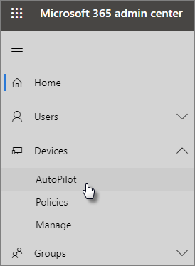

# Podrobné pokyny k přidání zařízení a profilů AutopilotaUse the step-by-step guide to add Autopilot devices and profile

Pomocí Windows AutoPilota můžete nastavit nová zařízení **s** Windows 10 pro vaši firmu, aby byla připravená k použití, když je dáte svým zaměstnancům.You can use Windows AutoPilot to set up **new** Windows 10 devices for your business so they're ready for use when you give them to your employees.
  
## Požadavky na zařízeníDevice requirements

Zařízení musí splňovat tyto požadavky:Devices must meet these requirements:
  
- Windows 10, verze 1703 nebo novějšíWindows 10, version 1703 or later
    
- Nová zařízení, která ještě nevyužíla prostředí WindowsNew devices that haven't been through Windows out-of-box experience
    
## Vytvoření zařízení a profilů pomocí průvodce instalacíUse the setup guide to create devices and profiles

Pokud jste skupiny zařízení nebo profily ještě nevytáčili, nejlepší způsob, jak začít, je použití podrobného průvodce.If you haven't created device groups or profiles yet, the best way to get started is by using the step-by-step guide. Můžete také [přidávat zařízení a](create-and-edit-autopilot-devices.md) [přiřazovat jim](create-and-edit-autopilot-profiles.md) profily bez použití průvodce.You can also [add devices](create-and-edit-autopilot-devices.md) and [assign profiles](create-and-edit-autopilot-profiles.md) to them without using the guide. 
  
1. Přejděte do Centra pro správu na adrese <a href="https://go.microsoft.com/fwlink/p/?linkid=837890" target="_blank">https://admin.microsoft.com</a> .Go to the admin center at <a href="https://go.microsoft.com/fwlink/p/?linkid=837890" target="_blank">https://admin.microsoft.com</a>.

2. V levém navigačním podokně zvolte **Zařízení** \> **AutoPilota**.On the left navigation pane, choose **Devices** \> **AutoPilot**.

    
  
2. Na stránce **AutoPilot** klikněte nebo klepněte na **Úvodní příručka**.On the **AutoPilot** page, click or tap **Start guide**.
    
    
  
3. Na stránce **Upload .csv file with list of devices** (Nahrát soubor .csv se seznamem zařízení) přejděte do umístění, kde máte připravené soubory . Soubor CSV a pak **Otevřít** \> **další**.On the **Upload .csv file with list of devices** page, browse to a location where you have the prepared .CSV file, then **Open** \> **Next**. Soubor musí mít tři záhlaví:The file must have three headers:
    
    - Sloupec A: Sériové číslo zařízeníColumn A: Device Serial Number
    
    - Sloupec B: ID produktu WindowsColumn B: Windows Product ID
    
    - Sloupec C: Hodnota hash hardwaruColumn C: Hardware Hash
    
    Tyto informace můžete získat od dodavatele hardwaru nebo můžete ke generování souboru CSV použít skript [Get-WindowsAutoPilotInfo PowerShellu.](https://www.powershellgallery.com/packages/Get-WindowsAutoPilotInfo)You can get this information from your hardware vendor, or you can use the [Get-WindowsAutoPilotInfo PowerShell script](https://www.powershellgallery.com/packages/Get-WindowsAutoPilotInfo) to generate a CSV file. 
    
    Další informace najdete v článku [Soubor CSV se seznamem zařízení](../admin/misc/device-list.md). Můžete si také stáhnout ukázkový soubor, který je na stránce **Nahrát soubor .csv obsahující seznam zařízení**.For more information, see [Device list CSV-file](../admin/misc/device-list.md). You can also download a sample file on the **Upload .csv file with list of devices** page. 
    
> [!NOTE]
> Tento skript používá službu WMI k načtení vlastností potřebných k registraci zařízení u Windows Autopilota.This script uses WMI to retrieve properties needed for a customer to register a device with Windows Autopilot. Všimněte si, že je normální, že výsledný soubor CSV neshromažďuje hodnotu ID produktu Windows (PKID), protože to není nutné k registraci zařízení a PKID je NULL ve výstupním souboru CSV je úplně v pořádku.Note that it is normal for the resulting CSV file to not collect a Windows Product ID (PKID) value since this is not required to register a device and PKID being NULL in the output CSV is totally fine. Vyplní se jenom sériové číslo a hardwarová hodnota hash.Only the serial number and hardware hash will be populated.
    
4. Na **stránce Přiřadit profil** můžete buď vybrat existující profil, nebo vytvořit nový.On the **Assign a profile** page, you can either pick an existing profile or create a new one. Pokud ho ještě nemáte, zobrazí se výzva k jeho vytvoření.If you don't have one yet, you'll be prompted to create one. 
    
    Profil je kolekce nastavení, kterou můžete použít u jednotlivých zařízení nebo u skupiny zařízení.A profile is a collection of settings that can be applied to a single device or to a group of devices.
    
    Výchozí funkce jsou povinné a automaticky se nastavují.The default features are required and are set automatically. Výchozí funkce:The default features are:
    
    - Přeskočte registraci Cortany, OneDrivu a OEM.Skip Cortana, OneDrive, and OEM registration.
    
    - Vytvoření postupu přihlášení doplněného o značku společnosti.Create sign-in experience with your company brand.
    
    - Připojte zařízení k účtům Azure Active Directory a automaticky je zaregistrujte, aby je spravoval Microsoft 365 Business Premium.Connect your devices to Azure Active Directory accounts, and automatically enroll them to be managed by Microsoft 365 Business Premium.
    
    Další informace najdete v tématu [O nastavení profilu AutoPilota](autopilot-profile-settings.md).For more information, see [About AutoPilot Profile settings](autopilot-profile-settings.md). 
    
5. Další nastavení jsou **Přeskočit nastavení ochrany osobních údajů** a **Nepovolit uživateli stát se místním správcem**. Obě volby jsou automaticky nastavené na **Vypnuto**.The other settings are **Skip privacy settings** and **Don't allow user to become the local admin**. These are both set to **Off** by default. 
    
    Zvolte **Další**.Choose **Next**.
    
6. **Hotovo znamená,** že profil, který jste vytvořili (nebo zvolili) se použije u skupiny zařízení, kterou jste vytvořili tak, že nahrajete seznam zařízení.**You're done** indicates that the profile you created (or chose) will be applied to the device group you created by uploading the list of devices. Nastavení se projeví, když se uživatelé zařízení přihlásí příště.The settings will be in effect when the device users sign in next. Zvolte **Zavřít**.Choose **Close**.
