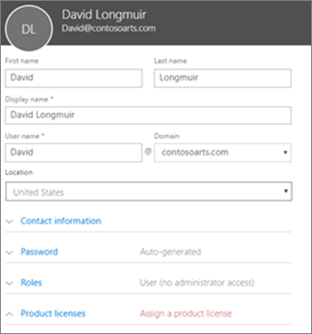
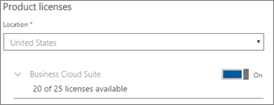

# Přidání dalších uživatelů do Microsoftu 365 Business

## Přidání nových uživatelů

Podívejte se na krátké video o přidání uživatele.   

> [!VIDEO https://www.microsoft.com/videoplayer/embed/RE1FOfN] 

Pokud bylo pro vás toto video užitečné, můžete se podívat na [kompletní sérii školení určených pro malé firmy a pro firmy, které se s Microsoftem 365 teprve seznamují](https://support.office.com/article/6ab4bbcd-79cf-4000-a0bd-d42ce4d12816).

Přidání uživatele:

1. Přejděte do Centra <a href="https://go.microsoft.com/fwlink/p/?linkid=837890" target="_blank">https://admin.microsoft.com</a>pro správu na adrese . 
2. V levém navigačním podokně zvolte **Uživatelé** \> **aktivní uživatelé**.
3. Na stránce **Aktivní uživatelé** zvolte **Přidat uživatele**.
4. Do panelu **Nový uživatel** zadejte požadované informace. 
  
    V části Kontaktní **informace**můžete zadat další informace , zvolit způsob nastavení hesla v části **Nastavení hesla** a přiřadit role v části **Role**.
      
    
      
    V části Licence na produkty nastavte nastavení licence na produkty **Microsoft 365 Business** **na zapnuto**.
      
    
  
Další informace o přidávání uživatelů naleznete v tématu [Přidání uživatelů jednotlivě nebo hromadně](https://docs.microsoft.com/office365/admin/add-users/add-users).
  
