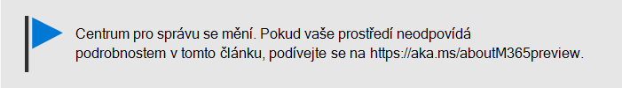
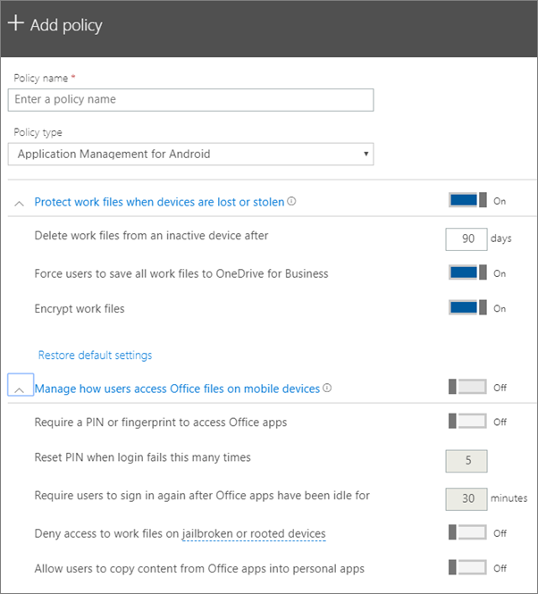

# Nastavení ochrany aplikací pro zařízení s Androidem nebo iOSem

## Vytvoření zásady správy aplikací

1. Přejděte do Centra <a href="https://go.microsoft.com/fwlink/p/?linkid=837890" target="_blank">https://admin.microsoft.com</a>pro správu na adrese . 
    
2. V levém nánosu zvolte **Přidat zásady** \> **Add** **zařízení** \> .
  
3. V podokně **Přidat zásadu** zadejte název, který je jedinečný. 
    
4. V části **Typ zásad**zvolte Správa aplikací **pro Android** nebo Správa aplikací **pro iOS**podle toho, kterou sadu zásad chcete vytvořit. 
    
5. Rozbalte **Možnost Chránit pracovní soubory při ztrátě nebo odcizení zařízení** a Správa **způsobu, jakým uživatelé přistupují k souborům Office na mobilních zařízeních**. Nakonfigurujte nastavení podle nejraději. **Spravujte, jak budou uživatelé přistupovat k souborům Office na mobilních zařízeních,** je ve výchozím nastavení **vypnutý,** ale doporučujeme je **zapnout** a přijmout výchozí hodnoty. Další informace naleznete v [tématu Available settings](#available-settings). 
    
    Pokud se chcete vrátit k výchozímu nastavení, použijte odkaz **Obnovit výchozí nastavení**. 
    
    
  
6. V dalším kroku rozhodněte, **pro koho tato nastavení platí**. Pokud nechcete používat výchozí skupinu zabezpečení **Všichni uživatelé,** zvolte **Změnit**, \> zvolte skupiny zabezpečení, které tato nastavení **získají Vyberte**.
    
7. Nakonec zvolte **Hotovo**, abyste zásadu uložili a přiřadili ji zařízením. 
    
## Úprava zásady správy aplikací

1. Na kartě **Zásady** zvolte **Upravit zásady**.
    
2. V podokně **Upravit zásadu** zvolte zásadu, kterou chcete změnit. 
    
3. Zvolte **Upravit** vedle každého nastavení, abyste upravili hodnoty dané zásady. Když změníte hodnotu, automaticky se uloží do zásady.
    
4. Po dokončení zavřete podokno **zásad úpravy.** 
    
## Odstranění zásady správy aplikací

1. Na stránce **Zásady** zvolte zásadu a **potom odstranit**.
    
2. V podokně **Odstranit zásady** zvolte **Potvrdit,** chcete-li odstranit zásady nebo zásady, které jste zvolili. 
    
## Dostupná nastavení

V následujících tabulkách jsou uvedeny podrobné informace o nastaveních, která jsou k dispozici pro ochranu pracovních souborů na zařízeních, a o nastaveních, která řídí způsob, jakým uživatelé přistupují ke souborům Office ze svých mobilních zařízení.
  
 Další informace najdete v článku o [mapování funkcí ochrany v Microsoft 365 Business na nastavení Intune](map-protection-features-to-intune-settings.md). 
  
### Nastavení chránící pracovní soubory

Pokud se zařízení uživatele ztratí nebo je odcizeno, jsou k dispozici pro ochranu pracovních souborů následující nastavení:
  
|||
|:-----|:-----|
|Nastavení    |Popis    |
|Odstranit pracovní soubory z neaktivního zařízení za    |Pokud se zařízení nepoužívá po dobu, kterou zde zadáte, všechny pracovní soubory uložené v zařízení se automaticky odstraní.    |
|Vynucovat, aby uživatelé ukládali všechny pracovní soubory na OneDrive pro firmy    |Pokud je toto nastavení **Zapnuto**, je jediným dostupným umístěním pro uložení pracovních souborů OneDrive pro firmy.    |
|Šifrovat pracovní soubory    |Toto nastavení nechejte **zapnuté**, aby byly pracovní soubory chráněné šifrováním. I v případě ztráty nebo odcizení zařízení nikdo nemůže číst údaje vaší společnosti.    |
   
### Nastavení spravující přístup uživatelů k souborům Office na mobilních zařízeních

Následující nastavení slouží ke správě přístupu uživatelů k pracovním souborům Office:
  
|||
|:-----|:-----|
|Nastavení    |Popis    |
|Vyžadovat pro přístup k aplikacím Office PIN nebo otisk prstu    |Pokud je toto nastavení **Zapnuto,** musí uživatelé před použitím aplikací Office na svých mobilních zařízeních kromě svého uživatelského jména a hesla poskytnout i jinou formu ověřování.  |
|Resetovat PIN po tomto počtu neúspěšných přihlášení    |Aby se zabránilo náhodnému uhodnutí PINu neoprávněným uživatelem, resetuje se PIN po vámi určeném počtu špatných pokusů.    |
|Vyžadovat, aby se uživatelé znovu přihlásili, pokud byly aplikace Office nečinné po dobu    |Toto nastavení určuje, jak dlouho může být uživatel nečinný, než se zobrazí výzva k opětovnému přihlášení.    |
|Odepřít přístup k pracovním souborům ze zařízení s jailbreakem nebo rootem    |Zruční uživatelé mohou mít zařízení s jailbreakem nebo rootem. To znamená, že takový uživatel může upravovat operační systém, což může zařízení učinit náchylnější vůči malwaru. Když je nastavení **zapnuté**, jsou tato zařízení blokovaná.    |
|Nepovolit uživatelům kopírování obsahu z aplikací Office do osobních aplikací    |Ve výchozím nastavení to povolujeme, ale pokud je nastavení **zapnuto**, může uživatel zkopírovat informace v pracovním souboru do osobního souboru. Pokud je nastavení **vypnuto**, uživatel nebude moci kopírovat informace z pracovního účtu do osobní aplikace nebo osobního účtu.    |
