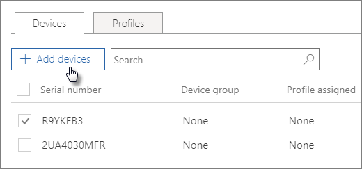

# Vytvoření a úpravy zařízení pomocí AutoPilotaCreate and edit AutoPilot devices

## Nahrání seznamu zařízeníUpload a list of devices

K [nahrání](add-autopilot-devices-and-profile.md) zařízení můžete použít podrobný průvodce, ale zařízení můžete nahrát taky na **kartě** Zařízení.You can use the [Step-by-step guide](add-autopilot-devices-and-profile.md) to upload devices, but you can also upload devices in the **Devices** tab. 
  
Zařízení musí splňovat tyto požadavky:Devices must meet these requirements:
  
- Windows 10, verze 1703 nebo novějšíWindows 10, version 1703 or later
    
- Nová zařízení, která ještě nevyužíla prostředí WindowsNew devices that haven't been through Windows out-of-box experience

1. V Centru pro správu Microsoftu 365 zvolte **Zařízení** \> **AutoPilota**.In the Microsoft 365 admin center, choose **Devices** \> **AutoPilot**.
  
2. Na stránce **AutoPilot** zvolte kartu **Zařízení –** \> **přidat zařízení**.On the **AutoPilot** page, choose the **Devices** tab \> **Add devices**.
    
    
  
3. Na panelu **Přidat zařízení** přejděte na soubor CSV [se seznamem](../admin/misc/device-list.md) zařízení, který jste připravili \> **Pro uložení** \> **zavřít.**On the **Add devices** panel, browse to a [Device list CSV file](../admin/misc/device-list.md) that you prepared \> **Save** \> **Close**.
    
    Tyto informace můžete získat od dodavatele hardwaru nebo můžete ke generování souboru CSV použít skript [Get-WindowsAutoPilotInfo PowerShellu.](https://www.powershellgallery.com/packages/Get-WindowsAutoPilotInfo)You can get this information from your hardware vendor, or you can use the [Get-WindowsAutoPilotInfo PowerShell script](https://www.powershellgallery.com/packages/Get-WindowsAutoPilotInfo) to generate a CSV file. 
    
## Přiřazení profilu zařízení nebo skupině zařízeníAssign a profile to a device or a group of devices

1. Na stránce **Příprava Windows**  zvolte kartu Zařízení a zaškrtněte políčko vedle jednoho nebo více zařízení.On the **Prepare Windows** page, choose the **Devices** tab, and select the check box next to one or more devices. 
    
2. Na panelu **Zařízení** vyberte v rozevíracím seznamu **Přiřazený profil** některý profil.On the **Device** panel, select a profile from the **Assigned profile** drop-down. 
    
    Pokud jste profily ještě nevytvořili, přečtěte si článek [Vytvoření a úpravy profilů AutoPilota](create-and-edit-autopilot-profiles.md).If you don't have any profiles yet, see [Create and edit AutoPilot profiles](create-and-edit-autopilot-profiles.md) for instructions. 
