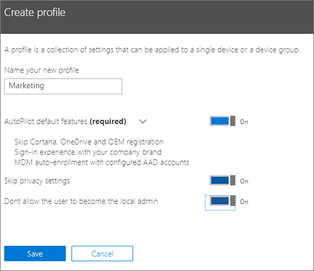
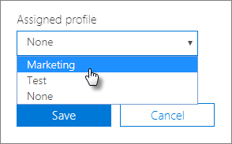

# Vytvoření a úpravy profilů AutoPilotaCreate and edit AutoPilot profiles

## Vytvoření profiluCreate a profile

Profil se používá pro zařízení nebo skupinu zařízení.A profile applies to a device, or a group of devices,
  
1. V Centru pro správu Microsoft 365 Business zvolte **Devices** \> **AutoPilot**.In the Microsoft 365 Business Admin center, choose **Devices** \> **AutoPilot**.
  
2. Na stránce **AutoPilot** zvolte \> kartu **Profily** **Vytvořit profil**.On the **AutoPilot** page, choose the **Profiles** tab \> **Create profile**.
    
3. Na stránce **Vytvořit profil** zadejte název profilu, který vám pomůže ho identifikovat, například Marketing.On the **Create profile** page, enter a name for the profile that helps you identify it, for example Marketing. Zapněte požadované nastavení a pak zvolte **Uložit**.Turn on the setting you want, and then choose **Save**. Další informace o nastavení profilu autopilota naleznete [v tématu O nastavení profilu autopilota](autopilot-profile-settings.md).For more information about AutoPilot profile settings, see [About AutoPilot Profile settings](autopilot-profile-settings.md).
    
    
  
### Použití profilu u zařízeníApply profile to a device

Po vytvoření profilu ho můžete použít na zařízení nebo skupinu zařízení.After you create a profile, you can apply it to a device or a group of devices. Můžete vybrat existující profil v [podrobnépříručce](add-autopilot-devices-and-profile.md) a použít jej na nová zařízení nebo nahradit existující profil pro zařízení nebo skupinu zařízení.You can pick an existing profile in the [step-by-step guide](add-autopilot-devices-and-profile.md) and apply it to new devices, or replace an existing profile for a device or group of devices. 
  
1. Na stránce **Připravit Windows** zvolte kartu **Zařízení**.On the **Prepare Windows** page, choose the **Devices** tab. 
    
2. Zaškrtněte políčko vedle názvu zařízení a v panelu **Zařízení** zvolte profil z \> rozevíracího **seznamu** **Uložit přiřazený profil** .Select the check box next to a device name, and in the **Device** panel, choose a profile from the **Assigned profile** drop-down list \> **Save**.
    
    
  
## Úprava, odstranění nebo odebrání profiluEdit, delete, or remove a profile

Jakmile zařízení přiřadíte profil, můžete profil aktualizovat, a to i tehdy, když jste zařízení předali uživateli. Když se zařízení připojí k internetu, stáhne si v průběhu nastavení nejnovější verzi profilu. Pokud uživatel obnoví v zařízení výchozí tovární nastavení, stáhne si zařízení do profilu nejnovější aktualizace.Once you've assigned a profile to a device, you can update it, even if you've already given the device to a user. When the device connects to the internet, it downloads the latest version of your profile during the setup process. If the user restores their device to its factory default settings, the device will again download the latest updates to your profile. 
  
### Úprava profiluEdit a profile

1. Na stránce **Připravit Windows** zvolte kartu **Profily**.On the **Prepare Windows** page, choose the **Profiles** tab. 
    
2. Zaškrtněte políčko vedle názvu zařízení a v panelu **Profil** aktualizujte libovolné z dostupných nastavení \> **Uložit**.Select the check box next to a device name, and in the **Profile** panel, update any of the available settings \> **Save**.
    
    Pokud to uděláte předtím, než uživatel připojí zařízení k internetu, použije se profil v procesu nastavení.If you do this before a user connects the device to the internet, then the profile gets applied to the setup process.
    
### Odstranění profiluDelete a profile

1. Na stránce **Připravit Windows** zvolte kartu **Profily**.On the **Prepare Windows** page, choose the **Profiles** tab. 
    
2. Zaškrtněte políčko vedle názvu zařízení a v panelu **Profil** vyberte **Odstranit profil** \> **Uložit**.Select the check box next to a device name, and in the **Profile** panel, select **Delete profile** \> **Save**.
    
    Pokud profil odstraníte, odebere se ze zařízení nebo skupiny zařízení, kterým byl přiřazen.When you delete a profile, it gets removed from a device or a group of devices it was assigned to.
    
### Odebrání profiluRemove a profile

1. Na stránce **Připravit Windows** zvolte kartu **Zařízení**.On the **Prepare Windows** page, choose the **Devices** tab. 
    
2. Zaškrtněte políčko vedle názvu zařízení a v panelu **Zařízení** zvolte **Žádný** z rozevíracího \> **seznamu**Uložit profil **přiřazený** .Select the check box next to a device name, and in the **Device** panel, choose **None** from the **Assigned profile** drop-down list \> **Save**.
    
