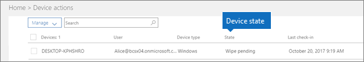

# Stavy zařízení

Tento článek se týká Microsoft 365 Business Premium.

Zařízení v seznamu **Akce zařízení** (domovská stránka správce \> **Akce zařízení**) můžou mít následující stavy.
  

  
|**Stav**|**Popis**|
|:-----|:-----|
|Spravováno službami Intune    |Spravuje Microsoft 365 Business Premium.    |
|Čeká se na vyřízení    |Microsoft 365 Business Premium se chystá odebrat firemní data ze zařízení.    |
|Probíhá vyřazování    |Microsoft 365 Business Premium v současné době odebírání firemních dat ze zařízení.    |
|Vyřazení selhalo    | Akce spočívající v odebrání dat společnosti se nezdařila.    |
|Vyřazení zrušeno    |Akce vyřazení byla zrušena.    |
|Čeká se na vymazání    |Čeká se na spuštění obnovení továrního nastavení.    |
|Probíhá mazání    |Byl vydán příkaz k obnovení továrního nastavení.    |
|Vymazání selhalo    |Nelze provést obnovení továrního nastavení.    |
|Vymazání zrušeno    |Factory wipe byl zrušen.    |
|Není v pořádku    |Akce čeká na vyřízení (nebo probíhá), ale zařízení se neověřilo po dobu 30+ dní.    |
|Čeká se na odstranění    |Čeká se na provedení akce odstranění.    |
|Zjištěné    |Microsoft 365 Business Premium zjistil zařízení.    |
   
