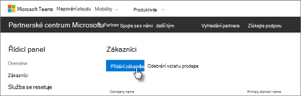
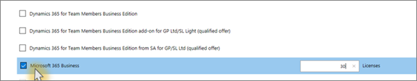

# Jak získat Microsoft 365 BusinessGet Microsoft 365 Business

## Získání Microsoft 365 Business od MicrosoftuGet Microsoft 365 Business from Microsoft

Pokud nemáte partnera a chcete získat Microsoft 365 Business, můžete si ho [koupit tady](https://www.microsoft.com/en-US/microsoft-365/business).If you don't have a partner and want to get Microsoft 365 Business, you can [buy it here](https://www.microsoft.com/en-US/microsoft-365/business).

Podrobné pokyny najdete v [tématu registrace k webu Microsoft 365 Business.](sign-up.md)See [sign up for Microsoft 365 Business](sign-up.md) for detailed instructions.

Můžete také přejít do [Obchodu Microsoft Store](https://www.microsoft.com/en-us/store/locations/find-a-store?icid=en_US_Store_UH_FAS) a koupit microsoft 365 Business a získat nápovědu k nastavení.You can also head over to a [Microsoft Store](https://www.microsoft.com/en-us/store/locations/find-a-store?icid=en_US_Store_UH_FAS) to buy Microsoft 365 Business and get setup help.
  
## Získání Microsoft 365 Business z partnerského centra MicrosoftuGet Microsoft 365 Business from Microsoft Partner Center

1. Přihlaste se do [partnerského centra Microsoftu](https://go.microsoft.com/fwlink/p/?linkid=849910). Použijte přihlašovací údaje, které jste vytvořili při registraci do programu poskytovatele cloudových služeb (CSP).Sign in at [Microsoft Partner Center](https://go.microsoft.com/fwlink/p/?linkid=849910) by using the credentials you created when you enrolled to the Cloud Service Provider (CSP) program. 
    
2. Na řídicím panelu partnera vyberte **Zákazníky**, pak vyberte zákazníka nebo přidejte nového zákazníka, než získáte Microsoft 365 Business.On the Partner Dashboard, choose **Customers**, then select your customer or add a new customer before you get Microsoft 365 Business.
    
    
  
3. Na stránce **Odběr** zákazníka vyberte **Přidat předplatné**, v části Katalog vyberte možnost Malá firma a pak zvolte **Microsoft 365 Business**.On the customer's **Subscription** page, select **Add subscription**, choose the Small business option under Catalog, and then choose **Microsoft 365 Business**.
    
    Vyberte požadovaný počet licencí (maximálně 300).Select the number of licenses you need (up to 300). Pokud máte více než 300 uživatelů, přejděte k [Microsoft 365 Enterprise](https://go.microsoft.com/fwlink/p/?linkid=862316).If you have more than 300 users, see [Microsoft 365 Enterprise](https://go.microsoft.com/fwlink/p/?linkid=862316) instead. 
    
    
  
    Dokončete zbytek kroků pro přidání nového zákazníka, včetně obchodního názvu.Complete the rest of the steps for adding a new customer, including the business name.
    

