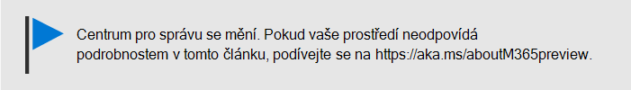

# Pomozte uživatelům nainstalovat Office na zařízení s Windows 10

Office můžete rychle a snadno nainstalovat na počítače s Windows 10 z Centra pro správu Microsoftu 365.
  
Pokud se chcete dozvědět, jak to funguje s dříve nainstalovanými aplikacemi Office, napřed si přečtěte článek [Příprava instalace klienta Office](prepare-for-office-client-deployment.md).

Podívejte se na krátké video o instalaci aplikací Office.  

> [!VIDEO https://www.microsoft.com/videoplayer/embed/acce002c-0756-4b64-ac5d-2198ee96a9b1] 

Pokud bylo pro vás toto video užitečné, můžete se podívat na [kompletní sérii školení určených pro malé firmy a pro firmy, které se s Microsoftem 365 teprve seznamují](https://support.microsoft.com/office/6ab4bbcd-79cf-4000-a0bd-d42ce4d12816).

## Správa nasazení Office

1. Přejděte do Centra pro správu na <a href="https://go.microsoft.com/fwlink/p/?linkid=2024339" target="_blank">https://admin.microsoft.com</a> stránce a přihlaste se pomocí přihlašovacích údajů globálního správce. 

2. V levém **navigačním** podokně přejděte na Nastavení a na stránce **Nastavení** přejděte na **Aplikace a aktualizace.**
    > [!NOTE]
    > Tato karta se nemusí zobrazit, pokud všichni vaši uživatelé nainstalovali aplikace Office.
  
3. Na kartě **Nápověda k instalaci aplikací Office** zvolte **Zobrazení** a pak **Začínáme.**
    
4. Na panelu **Poslat e-mailem** uživatelům odkaz ke stažení Office vyberte uživatele, které chcete poslat e-mailem, a pak **pošlete e-mail vybraným uživatelům.**

   

## Další informace o nastavení a používání Microsoft 365 Business Premium

[Školicí videa k Microsoftu 365 pro firmy](https://support.microsoft.com/office/6ab4bbcd-79cf-4000-a0bd-d42ce4d12816)