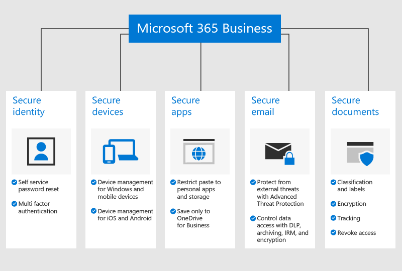

# Přehled Microsoft 365 Business

## Co je Microsoft 365 Business

Microsoft 365 Business je předplacená služba, která zahrnuje nástroje pro zvýšení produktivity Office 365 a pokročilé funkce, které pomáhají chránit vaši firmu před kybernetickými hrozbami, chránit data a spravovat zařízení.

Podívejte se na toto video pro rychlý přehled microsoft 365 business.  

> [!VIDEO https://www.microsoft.com/videoplayer/embed/RE2mhaA] 
  
Pokud je pro vás toto video užitečné, můžete se podívat na [kompletní sérii školení určených pro malé firmy a pro firmy, které se s Microsoftem 365 teprve seznamují](https://support.office.com/article/6ab4bbcd-79cf-4000-a0bd-d42ce4d12816). 

Microsoft 365 Business je určen až pro 300 licencí. Další informace naleznete v dokumentaci [k Microsoftu 365 Enterprise.](https://go.microsoft.com/fwlink/p/?linkid=860986)

Celý seznam funkcí naleznete [v popisu služby Microsoft 365 Business.](https://docs.microsoft.com/office365/servicedescriptions/microsoft-365-service-descriptions/microsoft-365-business-service-description)
  
## Potřeby zabezpečení malých podniků

Vaše obchodní data mohou být ohrožena mnoha způsoby. Vy a vaši uživatelé můžete ohrozit zabezpečení vaší organizace, když se přihlásíte pomocí kompromitovaných přihlašovacích údajů nebo zobrazení dat organizace na různých zařízeních a aplikacích. Přesněji řečeno, vaše organizace je ohrožena z:

- Kompromitovaná nebo slabá přihlašovací pověření.
- Kompromitované zařízení se slabým kolíkem nebo zařízení vlastněné uživatelem.
- Uživatelé, kteří mohou kopírovat/vkládat/ukládat data vaší organizace do osobních aplikací.
- Uživatelé, kteří instalují a používají aplikace třetích stran se slabým zabezpečením.
- Chyby zabezpečení e-mailů, včetně sdílení citlivých dat, pokusů o phishing, malwaru a tak dále.
- Když lidé, kteří by neměli, mohou přistupovat k dokumentům s citlivými informacemi.

Microsoft 365 Business pomáhá chránit vaše data v každé z těchto instancí. Funkce zabezpečení, které chrání vaše obchodní data, jsou podrobně popsány na následujícím obrázku.

## Jak jsou vaše data a zařízení chráněna

Microsoft 365 Business pomáhá **bránit před hrozbami** tím, že:

- Skenování odkazů v e-mailech a dokumentech v reálném čase blokovat nebezpečné webové stránky (ATP bezpečné odkazy).

- Provádění pokročilé analýzy e-mailových příloh v prostředí izolovaného prostoru pro detekci nově vyvinutého malwaru (bezpečné přílohy ATP). 

- Povolení zásad ochrany proti phishingu, které používají modely strojového učení a detekci zosobnění k zajištění ochrany před pokročilými útoky (atp anti-phishing intelligence). 

- Nastavení rozšířených zásad, které zakazují přístup z nedůvěryhodných umístění nebo obejdou vícefaktorové ověřování z důvěryhodných míst, jako je vaše síť office (Azure MFA včetně důvěryhodných IP serverů a Podmíněný přístup). 

- Vynucení ochrany proti malwaru na všech zařízeních s Windows 10 vaší organizace a ochrana souborů v klíčových systémových složkách před změnami provedenými ransomwarem (Windows Defender)

Vaše **obchodní data jsou chráněna:**

- Použití automatickédetekce k zabránění úniku citlivých informací, jako jsou čísla sociálního zabezpečení nebo kreditní karty, mimo vaši firmu (prevence ztrát dat). 

- Šifrování citlivých e-mailů, abyste mohli bezpečně komunikovat se zákazníky nebo jinými lidmi mimo vaši organizaci. Tím je zajištěno, že zprávu může číst pouze zamýšlený příjemce (šifrování zpráv Office 365).

- Řízení, kdo má přístup k informacím společnosti použitím omezení, jako je **Nekopírovat** a **Nepředávat dál** na e-mail a dokumenty (Azure Information Protection, Plán 1).

- Povolení neomezené archivace cloudu, abyste si mohli ponechat všechny e-maily vaší organizace, včetně poštovních schránek bývalých zaměstnanců (Exchange Online Archiving).

Vaše **zařízení jsou zabezpečena:**

- Řízení, která zařízení a uživatelé mají přístup k datům Office 365, s možnostmi blokovat uživatele v přihlášení z domácích počítačů, neschválených aplikací nebo mimo pracovní dobu (podmíněný přístup).

- Použití zásad zabezpečení k ochraně obchodních dat na zařízeních se systémem iOS a Android. Můžete například požadovat, aby uživatelé poskytli kód PIN nebo otisk prstu pro přístup k obchodním datům a šifrovat data na mobilních zařízeních (ochrana aplikací pro mobilní aplikace Office).

- Uchovávání obchodních dokumentů, e-mailů a dalších dat ve schválených mobilních aplikacích Office a zabránění zaměstnancům v jejich ukládání do neautorizovaných aplikací a míst (ochrana aplikací pro mobilní aplikace Office).

- Vzdálené vymazání obchodních dat ze ztracených nebo odcizených zařízení bez ovlivnění osobních údajů (selektivní vymazání Intune).

- Použití zjednodušených ovládacích prvků ke správě zásad pro všechny počítače s Windows 10 ve vaší společnosti, vynucení šifrování nástrojem BitLocker a automatická instalace důležitých aktualizací systému Windows (Vynutit zásady aktualizace systému Windows).

Úplný seznam funkcí zabezpečení najdete v [tématu Funkce zabezpečení Microsoft 365 Business](security-features.md). Po [nastavení Microsoft 365 Business](set-up.md)najdete v tématu [Zvýšení ochrany před hrozbami](increase-threat-protection.md) a [nastavení funkcí dodržování předpisů,](set-up-compliance.md) abyste mohli začít s funkcemi zabezpečení, které nejsou zahrnuty jako součást řízeného nastavení. Přečtěte si také [10 nejlepších způsobů zabezpečení plánů Office 365 a Microsoft 365 Business](https://docs.microsoft.com/office365/admin/security-and-compliance/secure-your-business-data) a dobrý přehled o tom, jak nastavit ochranu proti počítačovým zločincům a hackerům.

## Jak získat Microsoft 365 Business

- Pokud máte partnera, dostanou Microsoft 365 Business: [Získejte Microsoft 365 Business od Centra microsoft partnerů](get-microsoft-365-business.md#get-microsoft-365-business-from-microsoft-partner-center).

- Pokud nemáte partnera a chcete získat Microsoft 365 Business, můžete [si ho koupit zde](https://www.microsoft.com/microsoft-365/business) a postupujte podle pokynů k [registraci.](sign-up.md)

- Můžete také přejít do [Microsoft Storu,](https://www.microsoft.com/en-us/store/locations/find-a-store?icid=gm_fy18_hol_bopis_feature3&CustomerIntent=Consumer) kde si můžete koupit Microsoft 365 Business a získat nápovědu k nastavení.

    > [!NOTE]
    > Tento odkaz je určen pouze pro obchody v USA

## Viz také

[Školicí videa k Microsoftu 365 Business](https://support.office.com/article/6ab4bbcd-79cf-4000-a0bd-d42ce4d12816)
