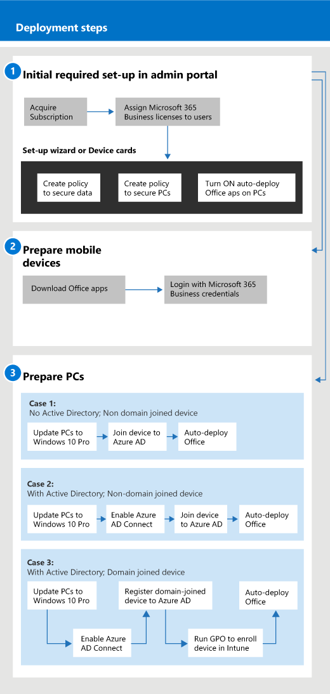

# Začínáme s Microsoft 365 pro firmy

## Co je Microsoft 365 pro firmy

Microsoft 365 pro firmy je komplexní sada nástrojů pro firemní produktivitu a spolupráci, jako je Outlook, Word, Excel a další produkty Office, které jsou vždy aktuální. Pracovní soubory můžete chránit na všech svých zařízeních s iOSem, Androidem a Windows 10 pomocí podnikového zabezpečení, které se snadno spravuje.

V tomto videu najdete rychlý přehled Microsoftu 365 pro firmy.  

> [!VIDEO https://www.microsoft.com/videoplayer/embed/RE2mhaA] 
  
Microsoft 365 pro firmy je určen až pro 300 licencí. Pokud potřebujete více licencí, najdete další informace v dokumentaci k [Microsoftu 365 Enterprise](../enterprise/index.yml). 
  
## Získejte Microsoft 365 pro firmy

- Pokud máte partnera, dostane Microsoft 365 pro firmy: [Získejte Microsoft 365 pro firmy z Partnerského centra Microsoftu.](get-microsoft-365-business.md)
    
- Pokud nemáte partnera a chcete získat Microsoft 365 pro firmy, můžete si ho [koupit tady](https://www.microsoft.com/microsoft-365/business).
    
## Nastavení Microsoftu 365 pro firmy

 **Přehled nastavení sady Microsoft 365 pro firmy**
  
Následující diagram popisuje, jak správci nastavili Microsoft 365 pro firmy. Popisuje také postup přípravy počítačů s Windows pro Microsoft 365 pro firmy. Nová zařízení můžete přidat taky v Centru pro správu Microsoftu 365 pomocí [Windows AutoPilota.](add-autopilot-devices-and-profile.md) AutoPilot můžete použít k nastavení a předběžné konfiguraci nových zařízení tak, aby byla připravená k produktivnímu použití, jakmile se uživatel přihlásí pomocí svých přihlašovacích údajů k Microsoftu 365 pro firmy.
  

V tomto videu najdete přehled nastavení Microsoftu 365 pro firmy.  

> [!VIDEO https://www.microsoft.com/videoplayer/embed/RE1FYSM] 

Pokud bylo pro vás toto video užitečné, můžete se podívat na [kompletní sérii školení určených pro malé firmy a pro firmy, které se s Microsoftem 365 teprve seznamují](https://support.microsoft.com/office/6ab4bbcd-79cf-4000-a0bd-d42ce4d12816).

  
### 1: Nastavení Microsoftu 365 pro firmy (správce)

Přihlaste se do Centra pro správu [Microsoftu 365](https://portal.office.com/adminportal/home) pomocí přihlašovacích údajů globálního správce a proveďte následující kroky k nastavení Microsoftu 365 pro firmy. 
  
1. [Předpoklady pro ochranu dat na zařízeních s Microsoft 365 pro firmy](pre-requisites-for-data-protection.md)
    
    Nejdřív si přečtěte požadavky, abyste se ujistili, že jsou vaše zařízení připravená pro Microsoft 365 pro firmy.
    
2. [Nastavení Microsoftu 365 pro firmy pomocí průvodce nastavením](set-up.md)
    
    Pokud se trvale přesouváte z místní služby Active Directory do **cloudu,** můžete přejít do Centra pro správu Microsoftu 365 a pomocí průvodce nastavením přidat uživatele ručně nebo můžete provést automatickou synchronizaci s Azure AD Connect. Můžete to udělat dvěma způsoby: 
    
    - Pokud máte taky server Exchange 2010, Exchange 2013 nebo Exchange 2016, můžete pomocí minimálního hybridního nasazení rychle migrovat poštovní schránky Exchange do [Microsoftu 365.](/Exchange/mailbox-migration/use-minimal-hybrid-to-quickly-migrate) K minimálním hybridním krokům patří časová synchronizace uživatelů s Azure AD a migrace e-mailu z místního do cloudu. Po dokončení migrace e-mailu se synchronizace adresářů automaticky vypne, když použijete tuto metodu.
    
    - Pomocí průvodce synchronizací adresářů synchronizujte uživatele s cloudem. Dokončete tento proces podle pokynů v článku Nastavení synchronizace adresářů pro [Microsoft 365.](../enterprise/set-up-directory-synchronization.md) Po synchronizaci uživatelů s cloudem budete muset vypnout synchronizaci [adresářů pro Microsoft 365](../enterprise/turn-off-directory-synchronization.md).
    
    Budete také muset dát každému uživateli, který byl tímto způsobem přidán, licenci na Microsoft 365 pro firmy. Můžete to udělat v průvodci [nastavením](set-up.md) nebo můžete přiřadit [licence uživatelům](../admin/manage/assign-licenses-to-users.md).
    
### 2: Příprava mobilních zařízení

Podle pokynů v článku Nastavení mobilních zařízení pro [uživatele Microsoftu 365](set-up-mobile-devices.md) pro firmy nainstalujte aplikace Office na zařízení a ujistěte se, že jsou chráněná Microsoftem 365 pro firmy. 
  
### 3: Příprava počítačů

Správci mohou předem vybrat nastavení pro nové počítače s Windows 10 pomocí [Windows AutoPilota.](add-autopilot-devices-and-profile.md) Uživatelé mohou nastavit stávající nebo nová zařízení s Windows 10 podle pokynů v tomto tématu: Nastavení počítačů s Windows pro [uživatele Microsoftu 365 pro firmy](set-up-windows-devices.md). U stávajících zařízení mohou uživatelé **volitelně** [přesouvat soubory na OneDrive pro firmy](move-files-to-onedrive.md). K přesunutí souborů přidružených k profilu Windows na OneDrive používejte taky nástroje třetích stran.
  
Pokud vaše organizace používá místní službu Windows Server Active Directory, můžete nastavit Microsoft 365 pro firmy tak, aby chránil vaše zařízení s Windows 10, a přitom zachovat přístup k místním prostředkům, které vyžadují místní ověřování. Postupujte podle pokynů v článku Povolení spravování zařízení s Windows 10 připojených k doméně [microsoftem 365 pro](manage-windows-devices.md) firmy. Tato metoda je upřednostňovaná a zařízení v tomto stavu se nazývají zařízení připojená **k Hybridní službě Azure AD**. 
  
Pokud si zachováte místní službu Active Directory, která obsahuje některé místní prostředky (například sdílené složky a tiskárny), můžete zařízením připojeným ke službě **Azure AD** dát přístup k těmto prostředkům podle pokynů tady: Přístup k místním prostředkům ze zařízení připojeného k Azure AD v [Microsoftu 365 pro firmy](access-resources.md).
  
  
## Kontaktování podpory

 **Pokud potřebujete kontaktovat podporu:**
  
- Obraťte se na partnera.
    
- Jako správce Microsoftu 365 pro firmy máte přístup k našemu týmu zákaznické podpory: Kontaktování podpory pro **[firemní produkty - Nápověda pro správce](../admin/contact-support-for-business-products.md)**
    
## Viz také

[Dokumentace a materiály k Microsoftu 365 pro firmy](./index.yml)
  
[Správa Microsoftu 365 pro firmy](manage.md)[Migrace na Microsoft 365 pro firmy](migrate-to-microsoft-365-business.md)

[Školicí videa k Microsoftu 365 pro firmy](https://support.microsoft.com/office/6ab4bbcd-79cf-4000-a0bd-d42ce4d12816)