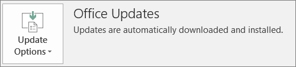

# Příprava na nasazení klienta Office microsoftem 365 pro firmy

Tento článek se týká Microsoft 365 Business Premium.

## Příprava k automatické instalaci aplikací Office na klientské počítače

Pomocí Microsoftu 365 Business Premium můžete automaticky nainstalovat 32bitové aplikace Office do počítačů s Windows 10 a udržovat je aktuální s aktualizacemi.
  
Automatická instalace funguje nejlépe, pokud je počítač koncového uživatele ve Windows 10 Business a:
  
- Nemá stávající desktopové aplikace Office (Word, Excel, PowerPoint, Outlook, OneNote, Publisher, Access a OneDrive).
    
    nebo
    
- Má nainstalovanou stávající verzi Office technologií Klikni a spusť.
    
Pokud potřebujete zjistit, jestli máte verzi Office nainstalovanou technologií Klikni a spusť, přejděte v libovolné aplikaci Office na **Soubor** \> **Účet** (v Outlooku je to **Účet Office**). Pokud se zobrazí **aktualizace sady Office,** jak je znázorněno na následujícím obrázku, instalace byla provedena pomocí technologie Klikni a spusť. 
  

  
 **Kdo má z této funkce prospěch**
  
Koncový uživatel s počítačem, který splňuje následující podmínky:
  
- **Má** uživatelskou licenci pro Windows 10 Business, aktivní licenci Microsoft 365 pro firmy, aktualizaci Windows 10 Creators Update a je připojená k Azure Active Directory. 
    
- **Nemá** 64bitové aplikace Office (například Word, Excel, PowerPoint). Pokud jsou vyžadovány 64bitové aplikace Office, pak se tato funkce nehodí, protože neexistuje žádná podpora pro aktivaci 64bitové verze Office s 2016 a spusť od kliknutí na konec sady Microsoft 365 pro firmy. 
    
- **Nemá** samostatné aplikace nainstalované instalační službou Windows 2016 (MSI), jako je Visio nebo Project. Microsoft 365 pro firmy upgraduje Office na verzi Office 2016 s technologiemi Klikni a to nefunguje se samostatnými aplikacemi MSI Office 2016. 
    
V následující tabulce je uvedeno, jakou akci mohou koncoví uživatelé nebo správci v závislosti na počátečním stavu provést, aby měli úspěšnou 32bitovou verzi nasazení Office s možností kliknutí na akci z konzoly Microsoft 365 pro firemní správu.
  
|**Počáteční stav instalace Office**|**Akce před instalací Microsoftu 365 pro firmy Office**|**Konečný stav**|
|:-----|:-----|:-----|
|Sada Office není nainstalovaná    |Žádné    |Office 2016 32bitový je nainstalovaný pomocí technologie Klikni a spusť    |
|Stávající 32bitová verze Office (2016 nebo starší) nainstalovaná technologií Klikni a spusť bez samostatných aplikací    |Žádné    |Upgrade na nejnovější 32bitovou verzi Office 2016 nainstalovanou technologií Klikni a spusť podle toho, co je potřeba **\***   |
|Existující 32bitová verze Office s 32bitovým a 32bitovým nebo 64bitovým samostatným officeovým office (například Visio, Project) s 32bitovým nebo 64bitovým samostatným officeem kliknu na cíl.    |Žádné    |Samostatné aplikace nejsou ovlivněny. Sada se upgraduje na 32bitovou verzi Office 2016 nainstalovanou technologií Klikni a spusť    |
|Stávající 32 bitová verze Office nainstalovaná technologií Klikni a spusť a všechny 32bitové nebo 64bitové samostatné aplikace Office nainstalované instalační službou MSI (s výjimkou verzí 2016)    |Žádné    |Samostatné aplikace nejsou ovlivněny. Sada se upgraduje na 32bitovou verzi Office 2016 nainstalovanou technologií Klikni a spusť    ||||
|Jakákoli stávající 64bitová verze Office nainstalovaná technologií Klikni a spusť    |Odinstalujte 64bitové aplikace Office, pokud je v pořádku nahradit 32bitovými aplikacemi Office    |Pokud jsou odebrané 64bitové verze aplikací Office, nainstaluje se 32bitová verze Office 2016 nainstalovaná technologií Klikni a spusť    |
|Stávající Office 2016 nainstalovaný instalační službou MSI se samostatnými aplikacemi nebo bez nich    |Odinstalujte Office 2016 nainstalovaný instalační službou MSI.    |32bitová verze Office 2016 nainstalovaná technologií Klikni a spusť. Samostatné aplikace zůstávají beze změn.    |
|Stávající instalace MSI systému Office 2013 (nebo předchozích verzí) a/nebo samostatné aplikace Office    |Žádná    |32bitová verze Office 2016 nainstalovaná technologií Klikni a spusť a předchozí instalace MSI systému Office (a samostatných aplikací) existují vedle sebe    |
||||
   
 **(\*) Poznámka:** Kvůli známé chybě není možné provést upgrade na 32bitovou verzi Office 2016 využívající technologii Klikni a spusť. Oprava probíhá. 
  
