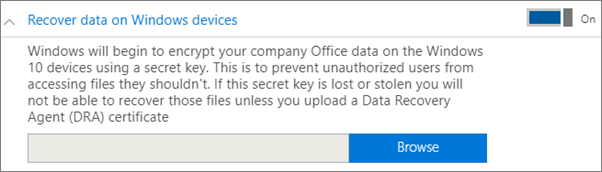
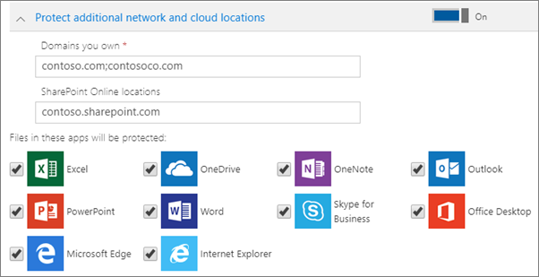

# Nastavení nebo úpravy nastavení ochrany aplikací pro zařízení s Windows 10

Tento článek se týká Microsoft 365 Business Premium.

## Úprava zásad správy aplikací pro Windows 10

1. Přejděte do Centra pro správu na adrese <a href="https://go.microsoft.com/fwlink/p/?linkid=837890" target="_blank">https://admin.microsoft.com</a> .     
2. V levém navigačním panelu zvolte **Zásady** \> **zařízení** .
1. Zvolte existující zásady aplikace pro Windows a pak **Upravit**.
1. Vedle **nastavení,** které chcete změnit, zvolte Upravit a pak **Uložit**.

## Vytvoření zásady správy aplikací pro Windows 10

Pokud mají uživatelé osobní zařízení s Windows 10, na kterých dělají pracovní úkoly, můžete chránit vaše data i na těchto zařízeních.
  
1. Přejděte do Centra pro správu na adrese <a href="https://go.microsoft.com/fwlink/p/?linkid=837890" target="_blank">https://admin.microsoft.com</a> . 
2. V levém navigačním panelu zvolte **Přidat** \> **zásady** \> **zařízení.**
3. V podokně **Přidat zásadu** zadejte název, který je jedinečný. 
4. V části **Typ zásady** zvolte **Správa aplikací pro Windows 10**.
5. V **části Typ zařízení** zvolte Osobní nebo **Vlastněné společností**. 
6. Možnost **Šifrovat pracovní soubory** je zapnutá automaticky. 
7. Pokud nechcete, aby uživatelé ukládali pracovní soubory na své počítače, **zapněte** možnost **Brání uživatelům v kopírování dat společnosti do osobních souborů a vynucuje, aby ukládali pracovní soubory na OneDrive pro firmy**. 
9. Rozbalte **obnovit data na zařízeních s Windows.** Doporučujeme ho **zapnout.**
    Než budete moct přejít do umístění certifikátu agenta obnovování dat, musíte nějaký nejprve vytvořit. Pokyny najdete v tématu Vytvoření a ověření certifikátu Agenta obnovení dat [systému souborů EFS (Encrypting File System) (DRA).](/windows/security/information-protection/windows-information-protection/create-and-verify-an-efs-dra-certificate)
    
    Ve výchozím nastavení jsou pracovní soubory šifrované pomocí tajného klíče, který je uložený v zařízení a přidružený k profilu uživatele. Soubor může otevřít a dešifrovat jenom uživatel. Pokud ovšem dojde ke ztrátě zařízení nebo odebrání uživatele, soubor může zůstat zašifrovaný. Správce může k dešifrování souboru použít certifikát Agenta obnovení dat (DRA).
    
    
  
10. Pokud **chcete přidat** další domény nebo umístění SharePointu Online, abyste měli jistotu, že jsou soubory ve všech uvedených aplikacích chráněné, rozbalte Zamknout další síťová a cloudová umístění. Pokud potřebujete zadat do jednoho z polí více než jednu položku, oddělte tyto položky středníkem (;).
    
    
  
11. V dalším kroku rozhodněte, **pro koho tato nastavení platí**. Pokud nechcete použít výchozí skupinu zabezpečení **Všichni uživatelé**, zvolte **Změnit** a vyberte skupinu zabezpečení, pro kterou se tato nastavení použijí \> **Vybrat**.
12. Volbou **Přidat** nakonec zásadu uložíte a přiřadíte ji zařízením.