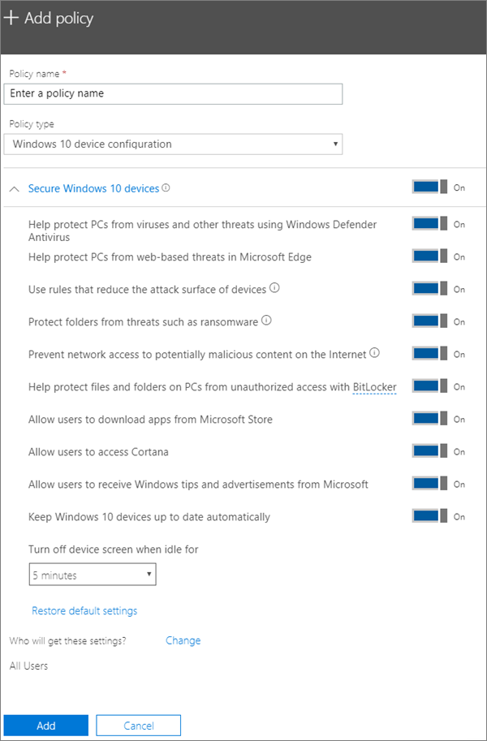

# Nastavení ochrany zařízení pro počítače s Windows 10Set device protection settings for Windows 10 PCs

Tento článek se týká Microsoft 365 Business Premium.This article applies to Microsoft 365 Business Premium.

## Zabezpečení zařízení s Windows 10Secure Windows 10 devices

Podívejte se na video o tom, jak zabezpečit zařízení s Windows 10 s Microsoftem 365 pro firmy:View a video on how to secure Windows 10 devices with Microsoft 365 for business:
  
> [!VIDEO https://www.microsoft.com/videoplayer/embed/a5734146-620a-4cec-8618-536b3ca37972?autoplay=false]
  
1. Přejděte do centra pro správu na adrese <a href="https://go.microsoft.com/fwlink/p/?linkid=837890" target="_blank">https://admin.microsoft.com</a> .Go to the admin center at <a href="https://go.microsoft.com/fwlink/p/?linkid=837890" target="_blank">https://admin.microsoft.com</a>. 
    
2. V levém navigačním zařízení zvolte **Přidat** \> **zásady zařízení** \> **Add**.On the left nav, choose **Devices** \> **Policies** \> **Add**.
  
3. V podokně **Přidat zásadu** zadejte název, který je jedinečný.On the **Add policy** pane, enter a unique name for this policy. 
    
4. V části **Typ zásady** zvolte **Konfigurace zařízení s Windows 10**.Under **Policy type**, choose **Windows 10 Device Configuration**.
    
5. Rozbalte **Zabezpečit zařízení s Windows 10** \> nakonfigurujte nastavení požadovaným způsobem.Expand **Secure Windows 10 Devices** \> configure the settings how you would like. Další informace naleznete v tématu [Dostupná nastavení](#available-settings).For more information, see [Available settings](#available-settings). 
    
    Pokud se chcete vrátit k výchozímu nastavení, použijte odkaz **Obnovit výchozí nastavení**.You can always use the **Reset default settings** link to return to the default setting. 
    
    
  
6. Next decide **Who will get these settings?** If you don't want to use the default **All users** security group, Choose **Change**, search for the security group who will get these settings \> **Select**.Next decide **Who will get these settings?** If you don't want to use the default **All users** security group, Choose **Change**, search for the security group who will get these settings \> **Select**.
    
7. Nakonec zvolte **Hotovo**, abyste zásadu uložili a přiřadili ji zařízením.Finally, choose **Done** to save the policy, and assign it to devices. 
    
## Dostupná nastaveníAvailable settings

Ve výchozím nastavení jsou všechny možnosti **zapnuté**.By default all settings are **On**. K dispozici jsou následující nastavení.The following settings are available.
  
Další informace najdete v tématu [Jak se funkce ochrany v mapě Microsoft 365 Premium na nastavení Intune](map-protection-features-to-intune-settings.md).For more information, see [How do protection features in Microsoft 365 Premium map to Intune settings](map-protection-features-to-intune-settings.md). 
  
|||
|:-----|:-----|
|NastaveníSetting    |PopisDescription    |
|Zvýšit ochranu počítačů před viry a dalšími hrozbami pomocí Antivirové ochrany v programu Windows DefenderHelp protect PCs from viruses and other threats using Windows Defender Antivirus    |Vyžaduje zapnutí antivirové ochrany v programu Windows Defender, aby bylo možné počítače chránit před nebezpečím spočívajícím v připojení k internetu.Requires that Windows Defender Antivirus is turned on to protect PCs from the dangers of being connected to the internet.    |
|Chránit počítače před webovými hrozbami v prohlížeči Microsoft EdgeHelp protect PCs from web-based threats in Microsoft Edge    |Zapne nastavení v Edgi, které pomáhá chránit uživatele před škodlivými weby a nebezpečným stahováním.Turns on settings in Edge that help protect users from malicious sites and downloads.    |
|Použít pravidla k omezení potenciálních oblastí útoku na zařízeníUse rules that reduce the attack surface of devices    |Pokud je omezování potenciálních oblastí útoku zapnuté, pomáhá blokovat akce a aplikace, které obvykle používá malware k napadnutí zařízení. Toto nastavení je dostupné jenom v případě, že je zapnutá Antivirová ochrana v programu Windows Defender. Další informace získáte v článku o [omezování potenciálních oblastí útoku](https://docs.microsoft.com/windows/security/threat-protection/microsoft-defender-atp/exploit-protection).  When turned On, attack surface reduction helps block actions and apps typically used by malware to infect devices. This setting is only available if Windows Defender Antivirus is set to On. See [Reduce attack surfaces](https://docs.microsoft.com/windows/security/threat-protection/microsoft-defender-atp/exploit-protection) to learn more.    |
|Chránit složky před hrozbami, jako je ransomwareProtect folders from threats such as ransomware    |Toto nastavení využívá řízený přístup ke složkám a chrání data společnosti před úpravami prostřednictvím podezřelých nebo škodlivých aplikací, jako je ransomware.This setting uses controlled folder access to protect company data from modification by suspicious or malicious apps, such as ransomware. Těmto typům aplikací se v chráněných složkách nepovolí provést změny.These types of apps are blocked from making changes in protected folders. Toto nastavení je dostupné jenom v případě, že je zapnutá Antivirová ochrana v programu Windows Defender.This setting is only available if Windows Defender Antivirus is set to On. Další informace najdete [v tématu Ochrana složek pomocí řízeného přístupu ke složkám.](https://docs.microsoft.com/mem/configmgr/protect/deploy-use/create-deploy-exploit-guard-policy#bkmk_CFA)See [Protect folders with Controlled folder access](https://docs.microsoft.com/mem/configmgr/protect/deploy-use/create-deploy-exploit-guard-policy#bkmk_CFA) to learn more.    |
|Bránit síťovému přístupu k potenciálně škodlivému obsahu na internetuPrevent network access to potentially malicious content on the Internet    |Toto nastavení slouží k blokování odchozích uživatelských připojení k internetovým lokacím s nízkou reputací, která mohou být hostitelem phishingových podvodů, zneužití nebo jiného škodlivého obsahu.Use this setting to block outbound user connections to low-reputation Internet locations that may host phishing scams, exploits, or other malicious content. Toto nastavení je k dispozici pouze v případě, že je antivirový program Programu Windows Defender nastaven na **hodnotu Zapnuto**.This setting is only available if Windows Defender Antivirus is set to **On**. Další informace naleznete v tématu [Ochrana sítě](https://docs.microsoft.com/windows/security/threat-protection/windows-defender-antivirus/configure-real-time-protection-windows-defender-antivirus).For more information, see [Protect your network](https://docs.microsoft.com/windows/security/threat-protection/windows-defender-antivirus/configure-real-time-protection-windows-defender-antivirus).    |
|Chránit soubory a složky na počítačích před neoprávněným přístupem pomocí BitLockeruHelp protect files and folders on PCs from unauthorized access with BitLocker    |Nástroj Bitlocker chrání data šifrováním pevných disků počítače a chrání před vystavením dat v případě ztráty nebo odcizení počítače.Bitlocker protects data by encrypting the computer hard drives and protect against data exposure if a computer is lost or stolen. Další informace naleznete v tématu [Bitlocker FAQ](https://go.microsoft.com/fwlink/?linkid=871000).For more information, see [Bitlocker FAQ](https://go.microsoft.com/fwlink/?linkid=871000).    |
|Povolit uživatelům stahovat aplikace z webu Microsoft StoreAllow users to download apps from Microsoft Store    |Umožňuje uživatelům stahovat a instalovat aplikace z webu Microsoft Store. Aplikací může být cokoli, od her až po nástroje na zvyšování produktivity, proto nechte toto nastavení **zapnuté**. Kvůli větší bezpečnosti ho ale můžete vypnout.  Lets users download and install apps from the Microsoft Store. Apps include everything from games to productivity tools, so we leave this setting **On**, but you can turn it off for extra security.    |
|Umožnit uživatelům přístup ke CortaněAllow users to access Cortana    |Cortana může být velmi užitečná!Cortana can be very helpful! Cortana může zapíná nebo vypíná nastavení, dávat pokyny a ujistit se, že jste na schůzky včas, takže toto **nastavení** ve výchozím nastavení zapínáme.Cortana can turn settings on or off for you, give directions, and make sure you're on time for appointments, so we keep this setting **On** by default.    |
|Povolit uživatelům přijímat tipy pro Windows a reklamy od společnosti MicrosoftAllow users to receive Windows tips and advertisements from Microsoft    |Praktické tipy k Windows mohou uživatelům pomoci zorientovat se v nově vydaných funkcích.Windows tips can be handy and help orient users when new features are released.    |
|Automaticky aktualizovat zařízení s Windows 10Keep Windows 10 devices up to date automatically    |Zajistí, aby zařízení s Windows 10 automaticky dostávala nejnovější aktualizace.Makes sure that Windows 10 devices automatically receive the latest updates.    |
|Vypnout obrazovku zařízení po nečinnostiTurn off device screen when idle for this amount of time    |Zajistí ochranu dat společnosti, když uživatel zařízení nepoužívá. Uživatel může pracovat na veřejném místě, jako je kavárna, a může si na chvilku odskočit nebo ho někdo vyruší. Informací na zařízení si může všimnout náhodný kolemjdoucí. Toto nastavení určuje, jak dlouho smí být uživatel nečinný, než se obrazovka vypne.Makes sure that company data is protected if a user is idle. A user may be working in a public location, like a coffee shop, and step away or be distracted for just a moment, leaving their device vulnerable to random glances. This setting lets you control how long the user can be idle before the screen shuts off.    |
