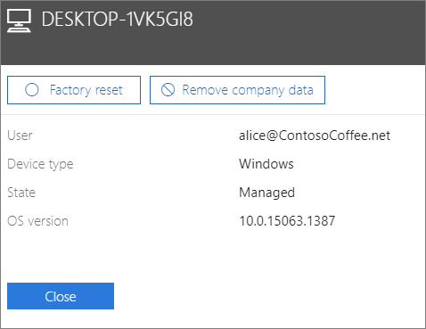

# Odebrání dat společnosti ze zařízení

## Odebrání dat společnosti

Microsoft 365 Business můžete použít k odebrání dat společnosti, která mají uživatelé na svých [zařízeních](app-protection-settings-for-android-and-ios.md) nebo [osobních počítačích s Windows](protection-settings-for-windows-10-devices.md) chráněných pomocí Microsoft 365. **Pokud ze zařízení odeberete data společnosti, nepůjdou později obnovit.** 
  
1. Přejděte do Centra <a href="https://go.microsoft.com/fwlink/p/?linkid=837890" target="_blank">https://admin.microsoft.com</a>pro správu na adrese .
    
2. Na levém virtuálním zařízení zvolte **Správa** **zařízení** \> .  
  
3. Na stránce **Spravovat** zvolte nebo vyhledejte uživatele, který má odebrat data, a zvolte název. 
    
4. V dalším podokně vyberte zařízení nebo zařízení ze seznamu **Zařízení.** V podokně zařízení, které se otevře, můžete v závislosti na typu zařízení obnovit tovární nastavení nebo odebrat firemní data. 
    
    
  
5. V potvrzovacím podokně zvolte **Potvrdit** \> **zavření**.
    

