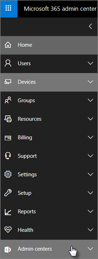

# Funkce zabezpečení a dodržování předpisů microsoft 365 Business Premium

Microsoft 365 Business Premium nabízí zjednodušené funkce zabezpečení, které pomáhají chránit vaše data na počítačích, telefonech a tabletech.
    
## Funkce zabezpečení Centra pro správu Microsoftu 365

V Centru pro správu můžete spravovat mnoho funkcí zabezpečení Microsoft 365 Business Premium, což vám umožní tyto funkce zapnout nebo vypnout. V Centru pro správu můžete provést následující kroky:
  
- [Nastavte nastavení správy aplikací pro zařízení se systémem Android nebo iOS](app-protection-settings-for-android-and-ios.md) . 
    
    Tato nastavení zahrnují odstranění souborů z neaktivního zařízení po nastavené mši, šifrování pracovních souborů, vyžadování nastavení kódu PIN uživateli a tak dále.
    
- [Nastavte nastavení ochrany aplikací pro zařízení s Windows 10](protection-settings-for-windows-10-devices.md) . 
    
    Tato nastavení lze použít pro firemní data na zařízeních vlastněných společností nebo na zařízeních vlastněných osobně.
    
- [Nastavte nastavení ochrany zařízení pro zařízení s Windows 10](protection-settings-for-windows-10-pcs.md) . 
    
    Šifrování [nástrojem BitLocker](https://go.microsoft.com/fwlink/p/?linkid=871405) můžete povolit, abyste ochránili data v případě ztráty nebo odcizení zařízení, a povolit službě [Windows Exploit Guard](https://docs.microsoft.com/windows/security/threat-protection/microsoft-defender-atp/enable-exploit-protection) poskytovat pokročilou ochranu před ransomwarem. 
    
- [Odebrání dat společnosti ze zařízení](remove-company-data.md)
    
    Pokud dojde ke ztrátě, odcizení zařízení nebo zaměstnanec opustí vaši společnost, můžete vzdáleně vymazat firemní data.
    
- [Obnovte nastavení zařízení s Windows 10 do továrního nastavení](reset-devices-to-factory-settings.md) . 
    
    Můžete obnovit všechna zařízení s Windows 10, na která se vztahují nastavení ochrany zařízení.
    
## Další funkce zabezpečení 

K dispozici jsou pokročilé funkce v Microsoft 365 Business Premium, které vám pomohou chránit vaši firmu před kybernetickými hrozbami a chránit citlivé informace.
  
- **[Rozšířená ochrana před hrozbami v Office 365](https://docs.microsoft.com/microsoft-365/security/office-365-security/office-365-atp)**
    
    Pokročilá ochrana před internetovými útoky (ATP) pomáhá chránit vaši firmu před sofistikovanými útoky phishingu a ransomware, které jsou navrženy tak, aby ohrozily informace o zaměstnancích nebo zákaznících. Mezi funkce patří:
    
  - Sofistikované skenování příloh a analýza založená na umělou ai.
    
  - Automatické kontroly odkazů v e-mailu, abyste zjistili, zda jsou součástí phishingového schématu. Tím budete v bezpečí před přístupem k nebezpečným webům.

- **[Kompletní možnosti Intune na webu Azure Portal](https://go.microsoft.com/fwlink/p/?linkid=871403)**
    
    Přístup k Centru pro správu Intune na webu Azure Portal umožňuje nastavit další funkce zabezpečení, jako je správa zařízení s MacOS, iPhone a Zařízení s Androidem, spolu s pokročilou správou zařízení pro Windows, které nejsou dostupné prostřednictvím Centra pro správu Microsoftu 365.
- **Stejný [podmíněný přístup](https://docs.microsoft.com/azure/active-directory/conditional-access/overview) jako plán Azure AD Premium P1**

    Podmíněný přístup může pomoci chránit vaši organizaci před rizikem přihlášení, pokusy o přístup z neočekávané sítě nebo národního prostředí, pokusy o přístup z rizikových typů zařízení a tak dále. Zásady podmíněného přístupu jsou vynuceny po dokončení prvního ověřování a používá signály z první události ověřování k určení, zda by měl být pokus o přístup schválen, odepřen nebo zda je vyžadován další důkaz (například druhý formulář identifikace).

    Zahrnuty jsou funkce podmíněného přístupu:

    - Přístup založený na uživatelském jménu, skupině a roli
    - Přístup [založený na aplikaci](https://docs.microsoft.com/azure/active-directory/conditional-access/app-based-conditional-access) 
    - [Přístup na základě umístění](https://docs.microsoft.com/azure/active-directory/authentication/howto-registration-mfa-sspr-combined#conditional-access-policies-for-combined-registration);  povolit přístup pouze z důvěryhodných rozsahů IP adres nebo z konkrétních zemí 
    - Vyžadovat vícefaktorové řízení pro přístup
    - Blokování přístupu k aplikacím, které používají [starší verze ověřování](https://docs.microsoft.com/azure/active-directory/conditional-access/block-legacy-authentication)
    - Vyžadovat, aby aplikace tp [používaly ochranu aplikací Intune](https://docs.microsoft.com/azure/active-directory/conditional-access/app-protection-based-conditional-access)
    - Vlastní ověřování, jako je například MFA s poskytovateli třetích stran, například DUO.
   
    Další funkce:
    - [Samoobslužné resetování hesla](https://docs.microsoft.com/azure/active-directory/authentication/concept-sspr-customization) pro hybridní Azure AD
    
## Funkce dodržování předpisů

Vaše předplatné Microsoft 365 Business Premium obsahuje funkce, které vám pomohou dodržovat standardy dodržování předpisů a regulační standardy.

- **[Přehled zásad prevence ztráty dat](https://docs.microsoft.com/microsoft-365/compliance/data-loss-prevention-policies)** (DLP). 
    
    Program DLP můžete nastavit tak, aby automaticky detekoval citlivé informace, jako jsou čísla kreditních karet, čísla sociálního pojištění a tak dále, abyste zabránili jejich neúmyslnému sdílení mimo vaši společnost.
    
- **[Exchange Online - archiv](https://products.office.com/exchange/microsoft-exchange-online-archiving-email)**
    
    Licence exchange online archivace umožňuje snadnou archivaci zpráv pomocí nepřetržitého zálohování dat. Ukládá všechny e-maily uživatele, včetně smazaných položek, v případě, že jsou později potřebné pro zjišťování nebo obnovu. Kromě toho můžete použít různé zásady uchovávání informací k zachování e-mailových dat pro blokování soudních sporů, eDiscovery nebo ke splnění požadavků na dodržování předpisů.
    
- **[Štítky utajení](https://docs.microsoft.com/microsoft-365/compliance/sensitivity-labels)**

   Microsoft 365 Business Premium obsahuje všechny funkce [Plánu ochrany informací Azure 1](https://go.microsoft.com/fwlink/p/?linkid=871407). Pomocí tohoto plánu můžete vytvořit **popisky citlivosti,** které umožňují řídit přístup k citlivým informacím v e-mailu a dokumentech pomocí ovládacích prvků jako "Nepředávat dál" a "Nekopírovat". Můžete také klasifikovat citlivé informace jako "důvěrné" a určit, jak mohou být utajované informace sdíleny mimo firmu i uvnitř podniku. Šifrování na podnikové úrovni se snadno aplikuje na e-maily a dokumenty, aby vaše informace zůstaly soukromé. Můžete taky nainstalovat doplněk klienta Azure Information Protection pro aplikace Office. Další informace najdete [v tématu Azure Information Protection sjednocené označování klienta](https://docs.microsoft.com/azure/information-protection/rms-client/unifiedlabelingclient-version-release-history). Pro popisky citlivosti nainstalujte **program AzInfoProtection_UL.exe**.

Tyto funkce můžete spravovat v Centru dodržování předpisů zabezpečení &amp; a v Centru pro správu Intune. V průběhu času budou zjednodušené ovládací prvky přidány do Centra pro správu Microsoftu 365.
  
    
## Časté otázky

 ### Jsou tyto funkce zabezpečení k dispozici na všech trzích?
  
Ano, tyto funkce jsou dostupné na všech trzích, kde se prodává Microsoft 365 Business Premium.
  
### Jak najdu Centrum &amp; dodržování předpisů zabezpečení?
  
1. [Přihlaste se k Microsoft 365 Business Premium](https://portal.microsoft.com/) pomocí přihlašovacích údajů správce. 
    
2. V levém nav vyhledejte **centra pro správu** a rozbalte je. 
    
    
  
3. Zvolte ** &amp; Dodržování předpisů zabezpečení** a přejděte do Centra dodržování předpisů &amp; zabezpečení.
