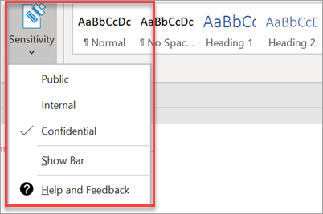

# Nastavení funkcí dodržování předpisůSet up compliance features

Microsoft 365 Business Premium je vybaven funkcemi, které chrání vaše data a zařízení a pomáhají vám zabezpečit citlivé informace vašich i zákazníků.Your Microsoft 365 Business Premium comes with features to protect your data and devices, and help you keep your and your customers' sensitive information secure.

## Nastavení funkcí DLPSet up DLP features

Příklad nastavení zásady ochrany před osobními údaji (PII) najdete v tématu [Vytvoření zásady ochrany před ochranou](https://docs.microsoft.com/microsoft-365/compliance/create-a-dlp-policy-from-a-template) před ochranou před ochranou proti přístupu k informacím pomocí šablony.See [Create a DLP policy from a template](https://docs.microsoft.com/microsoft-365/compliance/create-a-dlp-policy-from-a-template) for an example on how to set up a policy to protect against personally identifiable information (PII). 
  
DLP je dodáván s mnoha připravených šablon zásad pro mnoho různých národních prostředí.DLP comes with many ready-to-use policy templates for many different locales. Například Australia Financial Data, Canada Personal Information Act, US Financial Data atd.For example, Australia Financial Data, Canada Personal Information Act, U.S. Financial Data, and so on. Úplný seznam [najdete v tématu Co obsahují šablony zásad ochrany před](https://docs.microsoft.com/microsoft-365/compliance/what-the-dlp-policy-templates-include) únikem let.See [What the DLP policy templates include](https://docs.microsoft.com/microsoft-365/compliance/what-the-dlp-policy-templates-include) for a full list. Všechny tyto šablony lze povolit podobně jako příklad šablony PII.All of these templates can be enabled similar to the PII template example. 
  
## Nastavení uchovávání e-mailů pomocí archivace Exchange OnlineSet up email retention with Exchange Online Archiving

 Funkce licence **k archivaci Exchange Online** pomáhají udržovat dodržování předpisů a regulační standardy zachováním obsahu e-mailu pro eDiscovery.**Exchange Online Archiving** license features help maintain compliance and regulatory standards by preserving email content for eDiscovery. Pomáhá také snížit riziko, pokud dojde k soudnímu sporu, a poskytuje způsob, jak obnovit data po narušení zabezpečení nebo v případě, že potřebujete obnovit odstraněné položky.It also helps reduce your risk if there is a lawsuit, and provides a way to recover data after a security breach or when you need to recover deleted items. Blokování z důvodu soudního sporu můžete použít k zachování veškerého obsahu uživatele nebo pomocí zásad uchovávání informací můžete přizpůsobit, co chcete zachovat.You can use litigation hold to preserve all of a user's content, or use retention policies to customize what you want to preserve.
  
**Soudní řízení blokování:** Obsah poštovní schránky včetně odstraněných položek můžete zachovat tak, že celou poštovní schránku uživatele zadržíte.**Litigation hold:** You can preserve all mailbox content including deleted items by putting a user's entire mailbox on litigation hold. 
    
Pokud chcete poštovní schránku udát v Centru pro správu, jak se držet v soudních sporech:To place a mailbox on litigation hold, in the Admin center:
    
1. V levém navigačním programu **přejděte** na \> **Uživatelé Aktivní uživatelé**.In the left nav, go to **Users** \> **Active users**.
    
2. Vyberte uživatele, jehož poštovní schránku chcete umístit do blokování z důvodu soudního sporu.Select a user whose mailbox you want to place on litigation hold. V podokně uživatele rozbalte **položku Nastavení pošty**a vedle položky **Další nastavení**zvolte **Upravit vlastnosti serveru Exchange**.In the user pane, expand **Mail settings**, and next to **More settings**, choose **Edit Exchange properties**.
    
3. Na stránce poštovní schránky pro uživatele zvolte \*\* funkce poštovní schránky \*\* v levém navigačním panelu a pak zvolte odkaz **Povolit** v části **Blokování soudních sporů**.On the mailbox page for the user, choose \*\* mailbox features \*\* on the left nav, and then choose the **Enable** link under **Litigation hold**.
    
4. V dialogovém okně **blokování soudních sporů** můžete v poli Trvání blokování soudních sporů určit dobu **trvání blokování v soudních sporech.**In the **litigation hold** dialog box, you can specify the litigation hold duration in the **Litigation hold duration** field. Pokud chcete umístit nekonečné blokování, ponechte pole prázdné.Leave the field empty if you want to place an infinite hold. Můžete také přidat poznámky a nasměrovat vlastníka poštovní schránky na web, který budete muset vysvětlit více o blokování soudních sporů.You can also add notes and direct the mailbox owner to a website you might have to explain more about the litigation hold. \>**Uložit**.\> **Save**.
    
**Zadržení:** Můžete povolit přizpůsobené zásady uchovávání informací, například zachovat po určitou dobu nebo trvale odstranit obsah na konci doby uchovávání.**Retention:** You can enable customized retention policies, for example, to preserve for a specific amount of time or delete content permanently at the end of the retention period. Další informace najdete v [tématu Přehled zásad uchovávání informací](https://docs.microsoft.com/microsoft-365/compliance/retention-policies).To learn more, see [Overview of retention policies](https://docs.microsoft.com/microsoft-365/compliance/retention-policies).

## Nastavení popisků citlivostiSet up Sensitivity labels

Popisky citlivosti jsou dodávány s plánem Azure Information Protection (AIP) 1 a pomáhají vám klasifikovat a volitelně chránit vaše dokumenty a e-maily použitím štítků.Sensitivity labels come with Azure Information Protection (AIP) Plan 1, and help you classify, and optionally protect your documents and emails, by applying labels. Popisky mohou automaticky použít správci, kteří definují pravidla a podmínky, ručně uživateli nebo pomocí kombinace, kde jsou uživatelům poskytnuta doporučení.Labels can be applied automatically by administrators who define rules and conditions, manually by users, or by using a combination where users are given recommendations.

Chcete-li nastavit popisky citlivosti, [zobrazte zobrazení videa vytvořit a spravovat popisky citlivosti.](https://support.microsoft.com/office/2fb96b54-7dd2-4f0c-ac8d-170790d4b8b9)To set up Sensitivity labels, view [create and manage sensitivity labels](https://support.microsoft.com/office/2fb96b54-7dd2-4f0c-ac8d-170790d4b8b9) video.

### Ruční instalace klienta Azure Information ProtectionInstall the Azure Information Protection client manually

Ruční instalace klienta AIP:To manually install the AIP client:

1. Stáhněte **siAzinfoProtection_UL.exe** ze [služby Stažení softwaru](https://www.microsoft.com/download/details.aspx?id=53018)společnosti Microsoft .Download **AzinfoProtection_UL.exe** from [Microsoft download center](https://www.microsoft.com/download/details.aspx?id=53018).
 
2. Můžete ověřit, že instalace fungovala zobrazením dokumentu aplikace Word a ověřením, zda je na kartě **Domů** k dispozici možnost **Citlivost.**You can verify that the installation worked by viewing a Word document and making sure that the **Sensitivity** option is available on the **Home** tab.
 

Další informace naleznete [v tématu Instalace klienta](https://docs.microsoft.com/azure/information-protection/infoprotect-tutorial-step3).For more information, see [Install the client](https://docs.microsoft.com/azure/information-protection/infoprotect-tutorial-step3).
