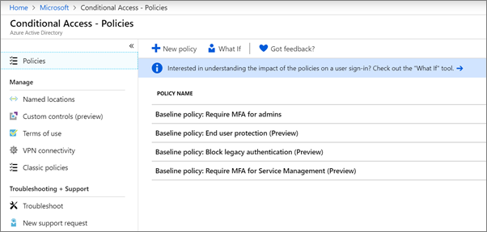

# Nastavení zásad podmíněného přístupu

[Zásady podmíněného přístupu](https://docs.microsoft.com/azure/active-directory/conditional-access/overview) přidávají značné dodatečné zabezpečení. Společnost Microsoft poskytuje sadu zásad podmíněného přístupu podle směrného plánu, které jsou doporučeny pro všechny zákazníky. Zásady směrného plánu jsou sadou předdefinovaných zásad, které pomáhají chránit organizace před mnoha běžnými útoky. Tyto běžné útoky mohou zahrnovat sprej hesla, přehrání a phishing.

Tyto zásady vyžadují, aby správci a uživatelé zadali druhou formu ověřování (tzv. vícefaktorové ověřování nebo vícefaktorové ověřování) při splnění určitých podmínek. Například pokud se uživatel přihlašuje z jiné země, přihlášení může být považováno za rizikové a uživatel musí poskytnout další formu ověřování. 

V současné době zásady směrného plánu zahrnují následující:
- **Vyžadovat vícefaktorové ověřování pro správce** &ndash; Vyžaduje vícefaktorové ověřování pro nejvíce privilegované role správce, včetně globálního správce.
- **Ochrana** &ndash; koncových uživatelů Vyžaduje vícefaktorové ověřování pro uživatele pouze v případě, že je přihlášení riskantní. 
- **Blokovat starší ověřování** &ndash; Starší klientské aplikace a některé nové aplikace nepoužívají novější, bezpečnější ověřovací protokoly. Tyto starší aplikace mohou obejít zásady podmíněného přístupu a získat neoprávněný přístup do vašeho prostředí. Tato zásada blokuje přístup od klientů, kteří nepodporují podmíněný přístup. 
- **Vyžadovat vícefaktorové ověřování pro správu** &ndash; služeb Vyžaduje vícefaktorové ověřování pro přístup k nástrojům pro správu, včetně portálu Azure (kde nakonfigurujete zásady směrného plánu). 

Společnost Microsoft doporučuje povolit všechny tyto zásady směrného plánu. Po povolení těchto zásad budou správci a uživatelé vyzváni k registraci pro ověřování Azure Multii-Factor.

Další informace o těchto zásadách naleznete v tématu [Co jsou zásady směrného plánu](https://docs.microsoft.com/azure/active-directory/conditional-access/concept-baseline-protection)?

## Nastavení zásad směrného plánu

1. Přejděte na [portál Azure](https://portal.azure.com)a přejděte na **podmíněný přístup** **služby Azure Active Directory** \> .
    
    Zásady směrného plánu jsou uvedeny na stránce.    
    
1. Podívejte se na následující konkrétní pokyny pro každou zásadu:

  - [Vyžadovat vícefaktorové pomocné správou pro správce](https://docs.microsoft.com/azure/active-directory/conditional-access/howto-baseline-protect-administrators)
- [Vyžadovat vícefaktorové faktory pro uživatele](https://docs.microsoft.com/azure/active-directory/conditional-access/howto-baseline-protect-end-users)  
 - [Blokovat starší verze ověřování](https://docs.microsoft.com/azure/active-directory/conditional-access/howto-baseline-protect-legacy-auth)
  - [Vyžadovat vícefaktorové řízení pro správu služeb](https://docs.microsoft.com/azure/active-directory/conditional-access/howto-baseline-protect-azure)

Můžete nastavit mnoho dalších zásad, například vyžadování schválených klientských aplikací. Další informace naleznete v [dokumentaci podmíněného přístupu](https://docs.microsoft.com/azure/active-directory/conditional-access/).
