# Nastavení mobilních zařízení pro Microsoft 365 pro firemní uživateleSet up mobile devices for Microsoft 365 for business users

Při instalaci Office na iPhone nebo telefon s Androidem dodržujte pokyny na kartách.Follow the instructions in the tabs to install Office on an iPhone or an Android phone. Po provedení těchto kroků budou vaše pracovní soubory vytvořené v Office aplikacích chráněny Microsoft 365 pro firmy.After you follow these steps, your work files created in Office apps will be protected by Microsoft 365 for business.

Následující příklad se týká Outlooku, ale platí i pro všechny ostatní aplikace Office, které chcete instalovat.The example is for Outlook, but applies for any other Office apps you want to install also.
  
## Nastavení mobilních zařízeníSet up mobile devices

## [iPhoneiPhone](#tab/iPhone)
  
Podívejte se na krátké video o tom, jak nastavit Office na zařízeních s iOSem s Microsoft 365 pro firmy.Watch a short video on how to set up Office apps on iOS devices with Microsoft 365 for business.  

> [!VIDEO https://www.microsoft.com/videoplayer/embed/RWee2n] 

Pokud bylo pro vás toto video užitečné, můžete se podívat na [kompletní sérii školení určených pro malé firmy a pro firmy, které se s Microsoftem 365 teprve seznamují](../business-video/index.yml).If you found this video helpful, check out the [complete training series for small businesses and those new to Microsoft 365](../business-video/index.yml).

Přejděte do **App Storu** a do vyhledávacího pole zadejte Microsoft Outlook.Go to **App store**, and in the search field type in Microsoft Outlook.
  
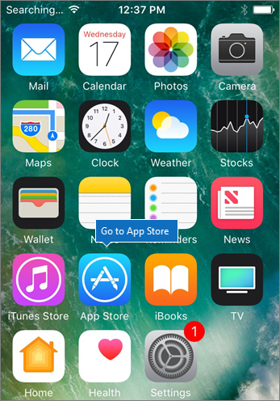
  
Klepnutím na ikonu cloudu nainstalujte Outlook.Tap the cloud icon to install Outlook.
  
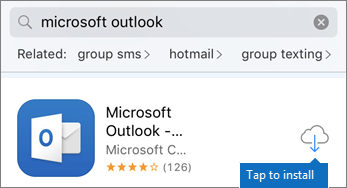
  
Po dokončení instalace klepněte na tlačítko **Otevřít**. Po otevření Outlooku klepněte na **Začínáme**.When the installation is done, tap the **Open** button to open Outlook and then tap **Get Started**.
  
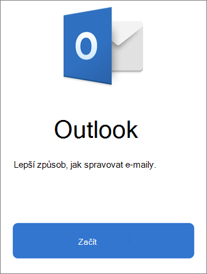
  
Zadejte svou pracovní e-mailovou adresu na **obrazovce** Přidat e-mailový účet Přidat účet a potom zadejte přihlašovací údaje Microsoft 365 pro firmy \>  \> **Přihlásit se**.Enter your work email address on the **Add Email Account** screen \> **Add Account**, and then enter your Microsoft 365 for business credentials \> **Sign in**.
  
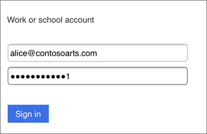
  
Pokud vaše organizace chrání soubory v aplikacích, zobrazí se dialogové okno s informacemi o tom, že vaše organizace teď chrání data v aplikaci, a budete muset aplikaci restartovat, abyste je mohli dál používat.If your organization is protecting files in apps, you'll see a dialog stating that your organization is now protecting the data in the app and you need to restart the app to continue to use it. Klepněte **na OK** a zavřete Outlook.Tap **OK** and close Outlook. 
  
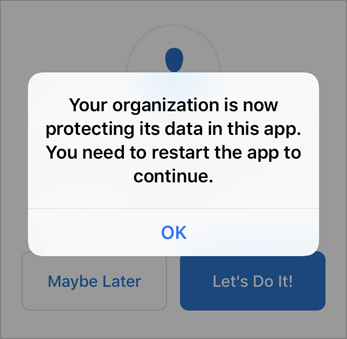
  
Najděte na iPhonu Outlook a restartujte ho.Locate Outlook on the iPhone, and restart it. Po zobrazení výzvy zadejte PIN kód a ověřte ho.When prompted, enter a PIN and verify it. Outlook v iPhonu je připravený k použití.Outlook on your iPhone is now ready to be used.
  
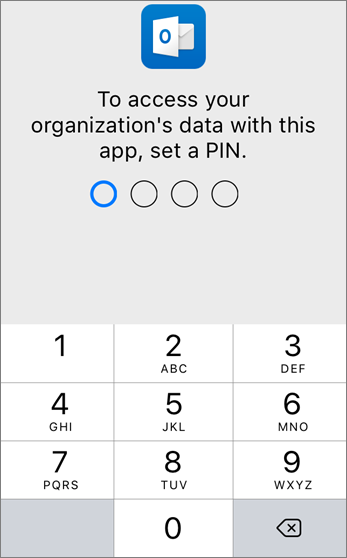
  
## [AndroidAndroid](#tab/Android)
  
Podívejte se na video o instalaci Outlook a Office na zařízeních s Androidem.Watch a video about installing Outlook and Office on Android devices.  

> [!VIDEO https://www.microsoft.com/videoplayer/embed/ecc2e9c0-bc7e-4f26-8b14-91d84dbcfef0] 

Pokud bylo pro vás toto video užitečné, můžete se podívat na [kompletní sérii školení určených pro malé firmy a pro firmy, které se s Microsoftem 365 teprve seznamují](../business-video/index.yml).If you found this video helpful, check out the [complete training series for small businesses and those new to Microsoft 365](../business-video/index.yml).

Pokud chcete začít s nastavením na telefonu s Androidem, přejděte do Play Storu.To begin setup on your Android phone, go to the Play Store.
  
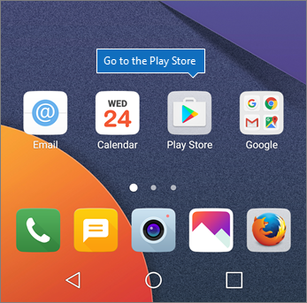
  
Do vyhledávacího Outlook Google Play zadejte Microsoft Outlook a klepněte na **Nainstalovat.**Enter Microsoft Outlook in the Google Play search box and tap **Install**. Po Outlook instalace klepněte na **Otevřít.**Once Outlook is done installing, tap **Open**.
  
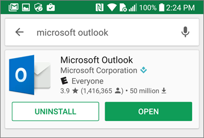
  
V aplikaci Outlook klepněte na **Začínáme,** přidejte svůj e-mailový účet Microsoft 365 pro firmy Pokračovat a přihlaste se pomocí přihlašovacích \> údajů vaší organizace.In the Outlook app, tap **Get Started**, then add your Microsoft 365 for business email account \> **Continue**, and sign in with your organization credentials.
  
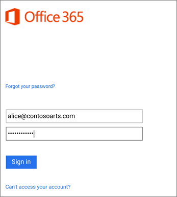
  
V dialogovém okně s informací o nutnosti instalace aplikace Portál společnosti Intune klepněte na **Přejít do Storu**.In the dialog that states you must install the Intune Company Portal app, tap **Go to store**.
  
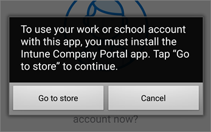
  
V Obchodě Play nainstalujte Portál společnosti Intune.In Play Store, install Intune Company Portal.
  
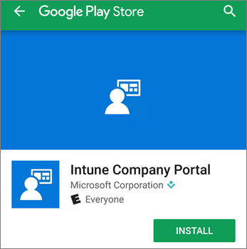
  
Znovu otevřete Outlook, zadejte PIN a potvrďte ho. Aplikace Outlook je připravená k použití.Open Outlook again, and enter and confirm a PIN. Your Outlook app is now ready for use.
  
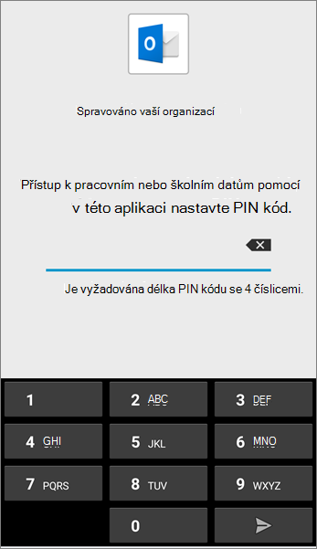

## Viz takéSee also

[Microsoft 365 pro firemní školicí videaMicrosoft 365 for business training videos](../business-video/index.yml)

---
