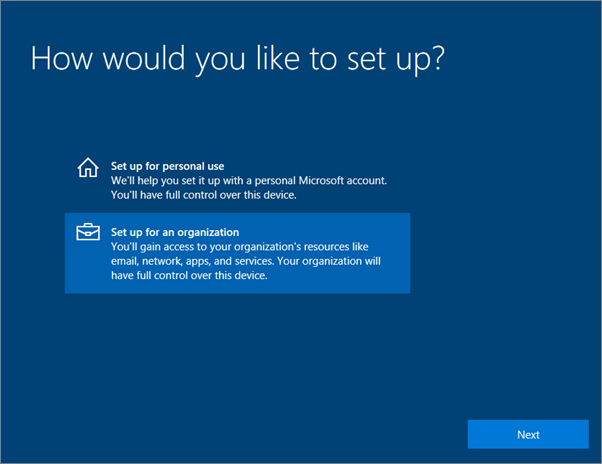
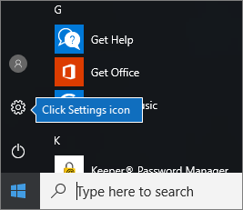
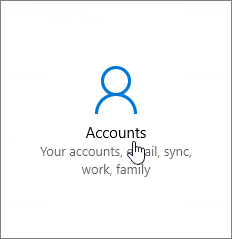
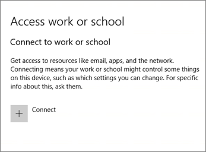
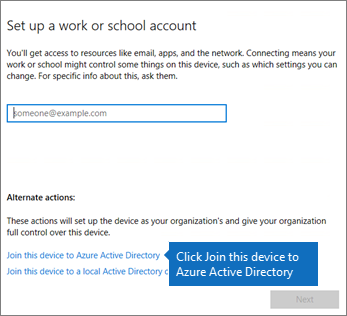
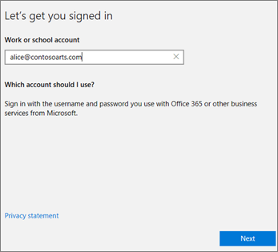
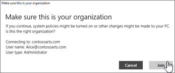
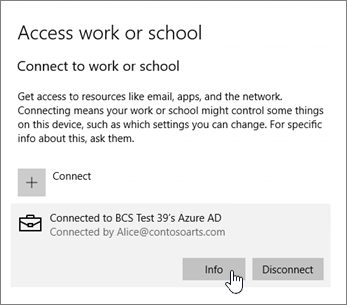
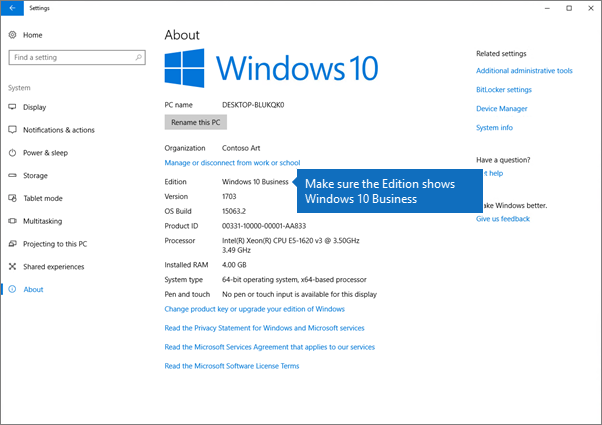

# Nastavení zařízení s Windows pro uživatele Microsoft 365 Business PremiumSet up Windows devices for Microsoft 365 Business Premium users

## Požadavky pro nastavení zařízení s Windows pro uživatele Microsoft 365 Business PremiumPrerequisites for setting up Windows devices for Microsoft 365 Business Premium users

Než budete moci nastavit zařízení s Windows pro uživatele Microsoft 365 Business Premium, ujistěte se, že všechna zařízení s Windows používají Windows 10 Pro, verze 1703 (Aktualizace pro autory).Before you can set up Windows devices for Microsoft 365 Business Premium users, make sure all the Windows devices are running Windows 10 Pro, version 1703 (Creators Update). Windows 10 Pro je nezbytným předpokladem pro nasazení Windows 10 Business, což je sada cloudových služeb a možností správy zařízení, které doplňují Windows 10 Pro a umožňují centralizovanou správu a ovládací prvky zabezpečení Microsoft 365 Business Premium.Windows 10 Pro is a prerequisite for deploying Windows 10 Business, which is a set of cloud services and device management capabilities that complement Windows 10 Pro and enable the centralized management and security controls of Microsoft 365 Business Premium.
  
Pokud máte zařízení s Windows 7 Pro, Windows 8 Pro nebo Windows 8.1 Pro, vaše předplatné Microsoft 365 Business Premium vás opravňuje k upgradu na Windows 10.If you have Windows devices running Windows 7 Pro, Windows 8 Pro, or Windows 8.1 Pro, your Microsoft 365 Business Premium subscription entitles you to a Windows 10 upgrade.
  
Další informace o upgradu zařízení s Windows na Windows 10 Pro Creators Update najdete v krocích popsaných v tomto tématu: [Upgrade zařízení s Windows na Windows Pro Creators Update](upgrade-to-windows-pro-creators-update.md).For more information on how to upgrade Windows devices to Windows 10 Pro Creators Update, follow the steps in this topic: [Upgrade Windows devices to Windows Pro Creators Update](upgrade-to-windows-pro-creators-update.md).
  
Viz [Ověření, zda je zařízení připojené k Azure AD,](#verify-the-device-is-connected-to-azure-ad) abyste ověřili, že máte upgrade, nebo abyste se ujistili, že upgrade fungoval.See [Verify the device is connected to Azure AD](#verify-the-device-is-connected-to-azure-ad) to verify you have the upgrade, or to make sure the upgrade worked.

Podívejte se na krátké video o připojení Windows k Microsoftu 365.Watch a short video about connecting Windows to Microsoft 365.  

> [!VIDEO https://www.microsoft.com/videoplayer/embed/RE3yXh3] 

Pokud bylo pro vás toto video užitečné, můžete se podívat na [kompletní sérii školení určených pro malé firmy a pro firmy, které se s Microsoftem 365 teprve seznamují](https://support.microsoft.com/office/6ab4bbcd-79cf-4000-a0bd-d42ce4d12816).If you found this video helpful, check out the [complete training series for small businesses and those new to Microsoft 365](https://support.microsoft.com/office/6ab4bbcd-79cf-4000-a0bd-d42ce4d12816).
  
## Připojení zařízení s Windows 10 ke službě Azure AD organizaceJoin Windows 10 devices to your organization's Azure AD

Pokud byla všechna zařízení s Windows ve vaší organizaci buď upgradována na aktualizaci Windows 10 Pro Creators Update, nebo už používáte aktualizaci Windows 10 Pro Creators Update, můžete tato zařízení připojit k Azure Active Directory vaší organizace.When all Windows devices in your organization have either been upgraded to Windows 10 Pro Creators Update or are already running Windows 10 Pro Creators Update, you can join these devices to your organization's Azure Active Directory. Jakmile se k nim připojíte, automaticky se upgradují na Windows 10 Business, který je součástí vašeho předplatného Microsoft 365 Business Premium.Once the devices are joined, they'll be automatically upgraded to Windows 10 Business, which is part of your Microsoft 365 Business Premium subscription.
  
### Zcela nové nebo nově upgradované zařízení s Windows 10 ProFor a brand new, or newly upgraded, Windows 10 Pro device

U zcela nového zařízení, na kterém běží Windows 10 Pro Creators Update, nebo u zařízení, které sice bylo upgradováno na Windows 10 Pro Creators Update, ale neproběhlo u něj nastavení zařízení s Windows 10, použijte tento postup.For a brand new device running Windows 10 Pro Creators Update, or for a device that was upgraded to Windows 10 Pro Creators Update but has not gone through Windows 10 device setup, follow these steps.
  
1. Projděte nastavení zařízení s Windows 10, dokud se nezobrazí stránka **Jak se má zařízení nastavit**.Go through Windows 10 device setup until you get to the **How would you like to set up?** page. 
    
    
  
2. Tady zvolte **Nastavit pro organizaci** a pak zadejte své uživatelské jméno a heslo pro Microsoft 365 Business Premium.Here, choose **Set up for an organization** and then enter your username and password for Microsoft 365 Business Premium. 
    
3. Dokončete nastavení zařízení s Windows 10.Finish Windows 10 device setup.
    
   Once you're done, the user will be connected to your organization's Azure AD.Once you're done, the user will be connected to your organization's Azure AD. See [Verify the device is connected to Azure AD](#verify-the-device-is-connected-to-azure-ad) to make sure.See [Verify the device is connected to Azure AD](#verify-the-device-is-connected-to-azure-ad) to make sure. 
  
### Nastavené zařízení se spuštěným systémem Windows 10 ProFor a device already set up and running Windows 10 Pro

 **Připojení uživatelů k Azure AD:****Connect users to Azure AD:**
  
1. V uživatelském počítači se systémem Windows 10 Pro ve verzi 1703 (Creators Update) (viz [předpoklady](pre-requisites-for-data-protection.md)) klikněte na klávesu s logem Windows a potom na ikonu Nastavení.In your user's Windows PC, that is running Windows 10 Pro, version 1703 (Creators Update) (see [pre-requisites](pre-requisites-for-data-protection.md)), click the Windows logo, and then the Settings icon.
  
   
  
2. V **Nastavení** přejděte na **Účty**.In **Settings**, go to **Accounts**.
  
   
  
3. Na stránce **Vaše informace** klikněte na **Přístup do práce nebo do školy** \> **Připojit**.On **Your info** page, click **Access work or school** \> **Connect**.
  
   
  
4. V dialogovém okně **Nastavit pracovní nebo školní účet** v části **Alternativní akce** zvolte **Připojit toto zařízení k Azure Active Directory**.On the **Set up a work or school account** dialog, under **Alternate actions**, choose **Join this device to Azure Active Directory**.
  
   
  
5. On the **Let's get you signed in** page, enter your work or school account \> **Next**.On the **Let's get you signed in** page, enter your work or school account \> **Next**.
  
   On the **Enter password** page, enter your password \> **Sign in**.On the **Enter password** page, enter your password \> **Sign in**.
  
   
  
6. Na stránce **Ujistěte se, že se jedná** o vaši organizaci, ověřte, zda jsou informace správné, a klepněte na tlačítko **Připojit**.On the **Make sure this is your organization** page, verify that the information is correct, and click **Join**.
  
   On the **You're all set!**On the **You're all set!** page, click **Done**.page, click **Done**.
  
   
  
Pokud jste nahráli soubory na OneDrive pro firmy, synchronizujte je zpět do počítače.If you uploaded files to OneDrive for Business, sync them back down. Pokud jste k migraci profilu a souborů použili nástroj jiného výrobce, synchronizujte je také s novým profilem.If you used a third-party tool to migrate profile and files, also sync those to the new profile.
  
## Kontrola připojení zařízení k Azure ADVerify the device is connected to Azure AD

Chcete-li ověřit stav synchronizace, klikněte na stránce **Práce nebo Škola aplikace Access** v **nastavení**klepnutím na oblast **Connected to** _ _ \<organization name\> tlačítka **Informace** a **Odpojení**.To verify your sync status, on the **Access work or school** page in **Settings**, click in the **Connected to** _ \<organization name\> _ area to expose the buttons **Info** and **Disconnect**. Kliknutím na možnost **Informace** zjistíte stav synchronizace.Click on **Info** to get your synchronization status. 
  
Pokud chcete pro tento počítač získat nejnovější zásady správy mobilních zařízení, klikněte na stránce Stav synchronizace na Synchronizovat.On the Sync status page, click Sync to get the latest mobile device management policies onto the PC.
  
Pokud chcete začít používat účet Microsoft 365 Business Premium, přejděte na tlačítko **Start** ve Windows, klikněte pravým tlačítkem myši na obrázek aktuálního účtu a potom **přepněte účet**.To start using the Microsoft 365 Business Premium account, go to the Windows **Start** button, right-click your current account picture, and then **Switch account**. Přihlaste se e-mailem a heslem vaší organizace.Sign in by using your organization email and password.
  

  
## Kontrola upgradu zařízení na Windows 10 BusinessVerify the device is upgraded to Windows 10 Business

Ověřte, že vaše zařízení Azure AD připojená k Windows 10 byla upgradována na Windows 10 Business jako součást předplatného Microsoft 365 Business Premium.Verify that your Azure AD joined Windows 10 devices were upgraded to Windows 10 Business as part of your Microsoft 365 Business Premium subscription.
  
1. Přejděte na **Nastavení** \> **Systém** \> **O systému**.Go to **Settings** \> **System** \> **About**.
    
2. Zkontrolujte, jestli **Edice** je **Windows 10 Business**.Confirm that the **Edition** shows **Windows 10 Business**.
    
    
  
## Další krokyNext steps

Informace o nastavení mobilních zařízení najdete v tématu [Nastavení mobilních zařízení pro uživatele Microsoft 365 Business Premium](set-up-mobile-devices.md), Nastavení zásad ochrany zařízení nebo ochrany aplikací v [tématu Správa Microsoftu 365 pro firmy](manage.md).To set up your mobile devices, see [Set up mobile devices for Microsoft 365 Business Premium users](set-up-mobile-devices.md), To set device protection or app protection policies, see [Manage Microsoft 365 for business](manage.md).
  
## Další informace o nastavení a používání Microsoftu 365 Business PremiumFor more on setting up and using Microsoft 365 Business Premium

[Školicí videa microsoftu 365 pro firmyMicrosoft 365 for business training videos](https://support.microsoft.com/office/6ab4bbcd-79cf-4000-a0bd-d42ce4d12816)
