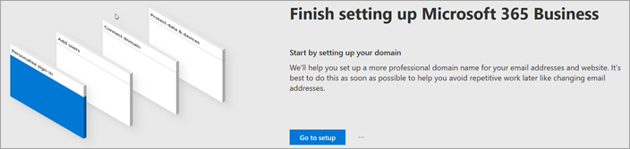
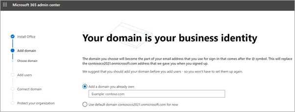
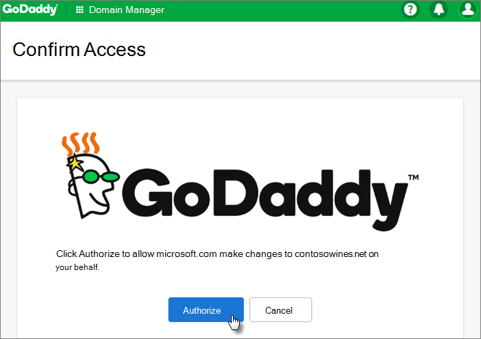
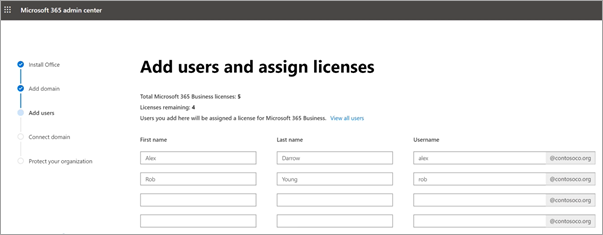
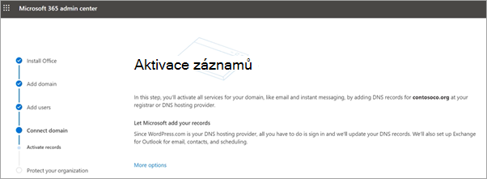
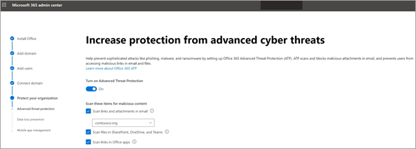
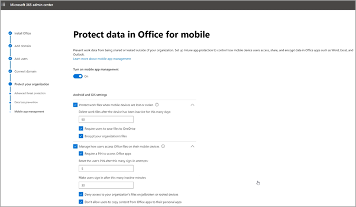

# Nastavení Microsoft 365 Business v průvodci instalacíSet up Microsoft 365 Business in the setup wizard

Podívejte se na toto video s přehledem nastavení Microsoftu 365 Business.Watch this video for an overview of Microsoft 365 Business setup.  

> [!VIDEO https://www.microsoft.com/videoplayer/embed/RE1FYSM] 

Pokud bylo pro vás toto video užitečné, můžete se podívat na [kompletní sérii školení určených pro malé firmy a pro firmy, které se s Microsoftem 365 teprve seznamují](https://support.office.com/article/6ab4bbcd-79cf-4000-a0bd-d42ce4d12816).If you found this video helpful, check out the [complete training series for small businesses and those new to Microsoft 365](https://support.office.com/article/6ab4bbcd-79cf-4000-a0bd-d42ce4d12816).

## Přidání domény, uživatelů a nastavení zásadAdd your domain, users, and set up policies

Při nákupu microsoftu 365 Business máte možnost použít doménu, kterou vlastníte, nebo ji zakoupit při [registraci](sign-up.md).When you purchase Microsoft 365 Business, you have the option of using a domain you own, or buying one during the [sign-up](sign-up.md).

- Pokud jste si při registraci zakoupili novou doménu, je vaše doména nastavena a můžete přejít na [Přidat uživatele a přiřadit licence](#add-users-and-assign-licenses).If you purchased a new domain when you signed up, your domain is all set up and you can move to [Add users and assign licenses](#add-users-and-assign-licenses).

### Přidání domény pro přizpůsobení přihlášeníAdd your domain to personalize sign-in

1. Přihlaste se k [Centru pro správu Microsoftu 365](https://admin.microsoft.com) pomocí přihlašovacích údajů globálního správce.Sign in to [Microsoft 365 admin center](https://admin.microsoft.com) by using your global admin credentials. 

2. Chcete-li průvodce spustit, zvolte **Přejít na nastavení.**Choose **Go to setup** to start the wizard.

    

3. Na stránce **Instalovat aplikace Office** můžete volitelně nainstalovat aplikace do vlastního počítače.On the **Install your Office apps** page, you can optionally install the apps on your own computer.
    
4. V kroku **Přidat doménu** zadejte název domény, který chcete použít (například contoso.com).In the **Add domain** step, enter the domain name you want to use (like contoso.com).

    > [!IMPORTANT]
    > Pokud jste si doménu zakoupili během registrace, zde se nezobrazí krok **Přidat doménu.**If you purchased a domain during the sign-up, you will not see **Add a domain** step here. Místo toho přejděte na [Přidat uživatele.](#add-users-and-assign-licenses)Go to [Add users ](#add-users-and-assign-licenses) instead.

    

    
4. Podle pokynů v průvodci [vytvořte záznamy DNS u libovolného poskytovatele hostingu DNS pro Office 365,](https://docs.microsoft.com/office365/admin/get-help-with-domains/create-dns-records-at-any-dns-hosting-provider) který ověří, že doménu vlastníte.Follow the steps in the wizard to [Create DNS records at any DNS hosting provider for Office 365](https://docs.microsoft.com/office365/admin/get-help-with-domains/create-dns-records-at-any-dns-hosting-provider) that verifies you own the domain. Pokud znáte hostitele domény, přečtěte si také [pokyny pro konkrétní hostitele](https://docs.microsoft.com/office365/admin/get-help-with-domains/set-up-your-domain-host-specific-instructions).If you know your domain host, see also the [host specific instructions](https://docs.microsoft.com/office365/admin/get-help-with-domains/set-up-your-domain-host-specific-instructions).

    Pokud je vaším poskytovatelem hostingu GoDaddy nebo jiným hostitelem s [povoleným připojením domény](https://docs.microsoft.com/office365/admin/get-help-with-domains/domain-connect), je proces snadný a budete automaticky požádáni o přihlášení a nechat Microsoft ověřovat vaším jménem.If your hosting provider is GoDaddy or another host enabled with [domain connect](https://docs.microsoft.com/office365/admin/get-help-with-domains/domain-connect), the process is easy and you'll be automatically asked to sign in and let Microsoft authenticate on your behalf.

    

### Přidání uživatelů a přiřazení licencíAdd users and assign licenses

Můžete přidat uživatele v průvodci, ale můžete také [přidat uživatele později](add-users-m365b.md) v Centru pro správu.You can add users in the wizard, but you can also [add users later](add-users-m365b.md) in the admin center. Navíc pokud máte místní řadič domény, můžete přidat uživatele s [Azure AD Connect](https://docs.microsoft.com/azure/active-directory/hybrid/how-to-connect-install-express).Additionally, if you have a local domain controller, you can add users with [Azure AD Connect](https://docs.microsoft.com/azure/active-directory/hybrid/how-to-connect-install-express).

#### Přidání uživatelů do průvodceAdd users in the wizard

Všem uživatelům, které přidáte do průvodce, bude automaticky přiřazena licence Microsoft 365 Business.Any users you add in the wizard get automatically assigned a Microsoft 365 Business license.

1. Pokud vaše předplatné Microsoft 365 Business má stávající uživatele (například pokud jste použili Azure AD Connect), získáte možnost přiřadit licence k nim teď.If your Microsoft 365 Business subscription has existing users (for example, if you used Azure AD Connect), you get an option to assign licenses to them now. Neváhejte a přidejte licence i jim.Go ahead and add licenses to them as well.

2. Po přidání uživatelů získáte také možnost sdílet přihlašovací údaje s novými uživateli, které jste přidali.After you've added the users, you'll also get an option to share credentials with the new users you added. Můžete je vytisknout, poslat e-mailem nebo si je stáhnout.You can choose to print them out, email them, or download them.

### Připojení doményConnect your domain

> [!NOTE]
> Pokud jste se rozhodli použít doménu .onmicrosoft nebo použít Azure AD Connect k nastavení uživatelů, tento krok se nezobrazí.If you chose to use the .onmicrosoft domain, or used Azure AD Connect to set up users, you will not see this step.
  
Abyste mohli nastavit služby, musíte aktualizovat některé záznamy u svého hostitele DNS nebo doménového registrátora.To set up services, you have to update some records at your DNS host or domain registrar.
  
1. Průvodce nastavením obvykle rozpozná vašeho registrátora a poskytne odkaz na podrobné pokyny pro aktualizaci vašich záznamů názvového serveru na webu registrátora.The setup wizard typically detects your registrar and gives you a link to step-by-step instructions for updating your NS records at the registrar website. Pokud tomu tak není, [změňte názvové servery a nastavte Office 365 u libovolného doménového registrátora](https://support.office.com/article/a8b487a9-2a45-4581-9dc4-5d28a47010a2).If it doesn't, [Change nameservers to set up Office 365 with any domain registrar](https://support.office.com/article/a8b487a9-2a45-4581-9dc4-5d28a47010a2). 

    - Pokud máte existující záznamy DNS, například existující web, ale váš hostitel DNS je povolen pro [připojení domény](https://docs.microsoft.com/office365/admin/get-help-with-domains/domain-connect), zvolte Přidat záznamy **pro mě**.If you have existing DNS records, for example an existing web site, but your DNS host is enabled for [domain connect](https://docs.microsoft.com/office365/admin/get-help-with-domains/domain-connect), choose **Add records for me**. Na stránce **Vyberte si online služby** přijměte všechny výchozí hodnoty a zvolte **Další**a na stránce hostitele DNS zvolte **Autorizovat.**On the **Choose your online services** page, accept all the defaults, and choose **Next**, and choose **Authorize** on your DNS host's page.
    - Pokud máte existující záznamy DNS s jinými hostiteli DNS (není povoleno pro připojení domény), budete chtít spravovat vlastní záznamy DNS, abyste se ujistili, že stávající služby zůstanou ve spojení.If you have existing DNS records with other DNS hosts (not enabled for domain connect), you'll want to manage your own DNS records to make sure the existing services stay connected. Další informace najdete v [základech domény.](https://docs.microsoft.com/office365/admin/get-help-with-domains/dns-basics)See [domain basics](https://docs.microsoft.com/office365/admin/get-help-with-domains/dns-basics) for more info.

        

2. Postupujte podle pokynů v průvodci a e-mail a další služby budou nastaveny pro vás.Follow the steps in the wizard and email and other services will be set up for you.

### Ochrana vaší organizaceProtect your organization 

Zásady nastavené v průvodci se automaticky použijí na [skupinu zabezpečení](https://docs.microsoft.com/office365/admin/create-groups/compare-groups#security-groups) nazvanou *Všichni uživatelé*.The policies you set up in the wizard are applied automatically to a [Security group](https://docs.microsoft.com/office365/admin/create-groups/compare-groups#security-groups) called *All Users*. Můžete také vytvořit další skupiny, ke kterým můžete přiřazovat zásady v Centru pro správu.You can also create additional groups to assign policies to in the admin center.

1. Pokud jde o **zvýšení ochrany před pokročilými kybernetickými hrozbami**, doporučujeme, abyste přijímali výchozí hodnoty a nechali [Office 365 Advance Threat Protection](https://docs.microsoft.com/microsoft-365/security/office-365-security/office-365-atp) prohledávat soubory a odkazy v aplikacích Office.On the **Increase protection from advanced cyber threats**, it is recommended that you accept the defaults to let [Office 365 Advance Threat Protection](https://docs.microsoft.com/microsoft-365/security/office-365-security/office-365-atp) scan files and links in Office apps.

    

2. Na stránce **Zabránit únikům citlivých dat** přijměte výchozí nastavení pro zapnutí funkce Office 365 Data Loss Prevention (DLP) za účelem sledování citlivých dat v aplikacích Office a zabránění náhodnému sdílení těchto dat mimo vaši organizaci.On the **Prevent leaks of sensitive data** page, accept the defaults to turn on Office 365 Data Loss Prevention (DLP) to track sensitive data in Office apps and prevent the accidental sharing of these outside your organization.

3. Na stránce **Chránit data v Office pro mobilní zařízení** ponechejte správu mobilních aplikací zapnutou, rozbalte nastavení a zkontrolujte je a pak vyberte Vytvořit **zásady správy mobilních aplikací**.On the **Protect data in Office for mobile** page, leave mobile app management on, expand the settings and review them, and then select **Create mobile app management policy**.

    

## Zabezpečení počítačů s Windows 10Secure Windows 10 PCs

Na levém virtuálním počítači vyberte **Instalační program** a potom v části **Sing-in a security**zvolte **Zabezpečit počítače s Windows 10**.On the left nav, select **Setup** and then, under **Sing-in and security**, choose **Secure your Windows 10 computers**. **Chcete-li začít,** zvolte Zobrazení.Choose **View** to get started. Kompletní pokyny najdete v [tématu zabezpečení počítačů s Windows 10.](secure-win-10-pcs.md)See [secure your Windows 10 computers](secure-win-10-pcs.md) for complete instructions.

## Nasazení klientských aplikací Office 365Deploy Office 365 client apps

Pokud jste se rozhodli automaticky instalovat aplikace Office během instalace, aplikace se nainstalují na zařízeních s Windows 10, jakmile se uživatelé přihlásí k Azure AD ze svých zařízení s Windows, pomocí jejich pracovních pověření.If you chose to automatically install Office apps during setup, the apps will install on the Windows 10 devices once the users have signed in to Azure AD from their Windows devices, using their work credentials.

Informace o instalaci Office na mobilní zařízení se systémem iOS nebo android najdete v tématu [Nastavení mobilních zařízení pro uživatele Microsoft 365 Business](set-up-mobile-devices.md).To install Office on mobile iOS or Android devices, see [Set up mobile devices for Microsoft 365 Business users](set-up-mobile-devices.md).

Office můžete nainstalovat také jednotlivě.You can also install Office individually. Pokyny [najdete v tématu instalace Office na PC nebo Mac.](https://support.office.com/article/4414eaaf-0478-48be-9c42-23adc4716658)See [install Office on a PC or Mac](https://support.office.com/article/4414eaaf-0478-48be-9c42-23adc4716658) for instructions.

## Viz takéSee also

[Školicí videa k Microsoftu 365 BusinessMicrosoft 365 Business training videos](https://support.office.com/article/6ab4bbcd-79cf-4000-a0bd-d42ce4d12816)
