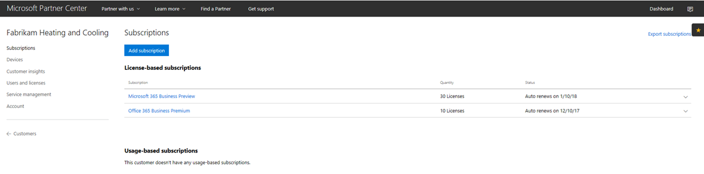
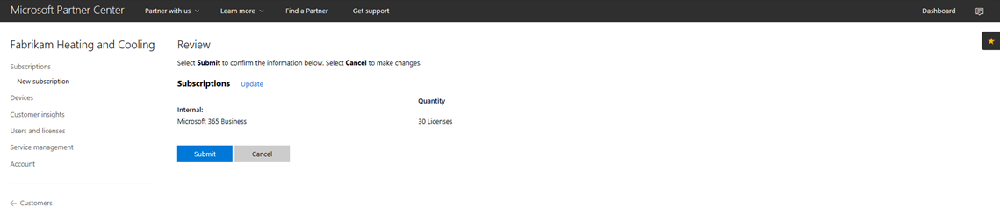
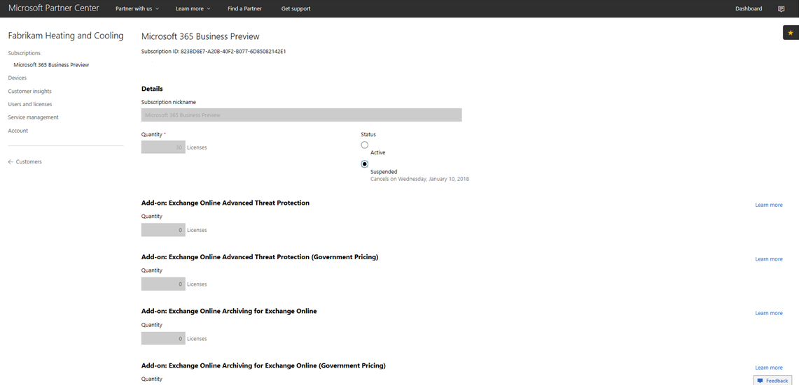
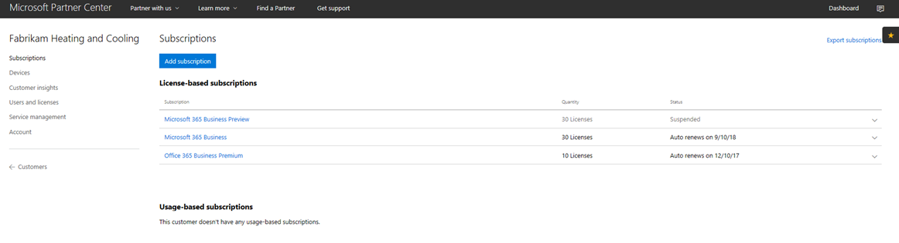
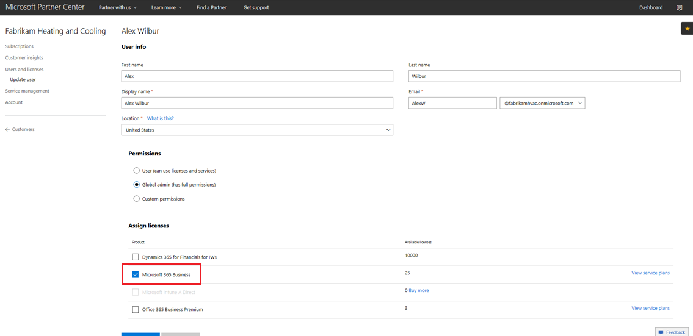

# Přechod předplatného Microsoft 365 Business CSP

Pokud máte předplatné CSP pro Microsoft 365 Business Preview, postupujte podle této příručky a zjistěte, jak můžete převést stávající předplatné preview na Microsoft 365 Business GA (obecná dostupnost).

**Jak převést předplatné předběžné verze na GA**

1. Přihlaste se do <a href="https://partnercenter.microsoft.com" target="_blank">Centra partnerů</a>.
2. Na řídicím panelu vyberte **Zákazníci**a pak vyhledejte a vyberte název společnosti.

    Odběry pro společnost budou uvedeny.

    
    
3. Na stránce **Předplatná** společnosti vyberte **Přidat předplatné**.
4. Na stránce **Nové předplatné** vyberte **Malá firma** a ze seznamu vyberte **Microsoft 365 Business.**
5. Přidejte počet licencí a pak vyberte **Další: Zkontrolujte** předplatné a pak vyberte **Odeslat**.

    

    V **licenčních předplatných** se zobrazí **Microsoft 365 Business Preview** a Microsoft **365 Business**. Předplatné Preview pozastavíte jako další.

6. Vyberte **Microsoft 365 Business Preview**.
7. Na stránce **Microsoft 365 Business Preview** vyberte **Pozastaveno,** chcete-li předplatné Preview pozastavit.

    

8. Vyberte **Odeslat,** chcete-li potvrdit.

    Na stránce **Předplatná** zkontrolujte, zda je ve stavu **Microsoft 365 Business Preview** **zobrazeno pozastaveno**.

    

9. Volitelně můžete také ověřit licenční smlouvu. Uděláte to takto:
    1. Na stránce **Předplatná** společnosti vyberte **Uživatelé a licence.**
    2. Na stránce **Uživatelé a licence** vyberte uživatele.
    3. Na stránce uživatele zkontrolujte část **Přiřadit licence** a potvrďte, že se zobrazuje **Microsoft 365 Business**.

        

## Dopad na zákazníky a uživatele během přechodu a po něm

Během přechodu a přechodu na zákazníky a uživatele to nemá žádný vliv.

## Dopad na zákazníky, kteří nepřecházejí

Následující tabulka shrnuje dopad na zákazníky, kteří nepřecházejí z předplatného Microsoft 365 Business Preview na předplatné Microsoft 365 Business.

|       | T-0 až T+30     | T+30 až T+60 | T+60 až T+120 | Za T+120  |
|-------|-----------------|--------------|---------------|---------------|
| **Stav** | V období odkladu | Vypršela      | Zakázán      | Zrušení zřízení |
| **Dopady služeb**                                                        |
| **Portál pro správu Microsoftu 365 Business** | Žádný vliv na funkčnost | Žádný vliv na funkčnost | Můžete přidávat/ mazat uživatele, nakupovat předplatná.  Nelze přiřadit nebo odvolat licence. | Předplatné zákazníka a všechna data budou smazána. Správce může spravovat další placená předplatná. |
| **Aplikace Office**                         | Žádný dopad na koncového uživatele | Žádný dopad na koncového uživatele | Office přejde do režimu snížené funkčnosti.  Uživatelé mohou zobrazit pouze soubory. | Office přejde do režimu snížené funkčnosti.  Uživatelé mohou zobrazit pouze soubory. |
| **Cloudové služby (SharePoint Online, Exchange Online, Skype, Teams a další)** | Žádný dopad na koncového uživatele | Žádný dopad na koncového uživatele | Koncoví uživatelé a správci nemají přístup k datům v cloudu. | Předplatné zákazníka a všechna data jsou smazána. |
| **Em+ S komponenty** | Žádný dopad na správce  Žádný dopad na koncového uživatele | Žádný dopad na správce  Žádný dopad na koncového uživatele | Funkce již není vynucena.  Další [informace najdete v tématu Dopady na mobilní zařízení po vypršení platnosti předplatného](#mobile-device-impacts-upon-subscription-expiration) a [dopady na počítač s Windows 10 po vypršení platnosti předplatného.](#windows-10-pc-impacts-upon-subscription-expiration) | Funkce již není vynucena.  Další [informace najdete v tématu Dopady na mobilní zařízení po vypršení platnosti předplatného](#mobile-device-impacts-upon-subscription-expiration) a [dopady na počítač s Windows 10 po vypršení platnosti předplatného.](#windows-10-pc-impacts-upon-subscription-expiration) |
| **Windows 10 Business** | Žádný dopad na správce  Žádný dopad na koncového uživatele | Žádný dopad na správce  Žádný dopad na koncového uživatele | Funkce již není vynucena.  Další [informace najdete v tématu Dopady na mobilní zařízení po vypršení platnosti předplatného](#mobile-device-impacts-upon-subscription-expiration) a [dopady na počítač s Windows 10 po vypršení platnosti předplatného.](#windows-10-pc-impacts-upon-subscription-expiration) | Funkce již není vynucena.  Další [informace najdete v tématu Dopady na mobilní zařízení po vypršení platnosti předplatného](#mobile-device-impacts-upon-subscription-expiration) a [dopady na počítač s Windows 10 po vypršení platnosti předplatného.](#windows-10-pc-impacts-upon-subscription-expiration) |
| **Přihlášení azure ad k počítači s Windows 10** | Žádný dopad na správce  Žádný dopad na koncového uživatele | Žádný dopad na správce  Žádný dopad na koncového uživatele | Žádný dopad na správce  Žádný dopad na koncového uživatele | Po odstranění klienta se uživatel může přihlásit pouze s místními přihlašovacími údaji. Pokud nejsou k dispozici žádná místní pověření, znovu si to představte. |

## Vliv mobilního zařízení na vypršení platnosti předplatného

Následující tabulka shrnuje dopad zásad správy aplikací na mobilní zařízení.

|                            | Plně licencované prostředí                      | T+60 dní po vypršení platnosti          |
|----------------------------|------------------------------------------------|------------------------------------|
| **Odstranění pracovních souborů z neaktivního zařízení** | Pracovní soubory jsou odebrány po vybraných dnech | Pracovní soubory zůstávají na osobních zařízeních uživatele |
| **Vynucovat, aby uživatelé ukládali všechny pracovní soubory na OneDrive pro firmy** | Pracovní soubory se můžou ukládat jenom na OneDrive pro firmy. | Pracovní soubory lze uložit kdekoli |
| **Šifrovat pracovní soubory** | Pracovní soubory jsou šifrovány | Pracovní soubory již nejsou šifrovány.  Zásady zabezpečení se odeberou a data Office v aplikacích se odeberou. |
| **Vyžadovat pro přístup k aplikacím Office kód PIN nebo otisk prstu** | Omezený přístup k aplikacím | Žádné omezení přístupu na úrovni aplikace |
| **Resetovat PIN kód při selhání přihlášení** | Omezený přístup k aplikacím | Žádné omezení přístupu na úrovni aplikace |
| **Vyžadovat, aby se uživatelé znovu přihlásili po nečinnosti aplikací Office** | Je vyžadováno přihlášení. | Není vyžadováno žádné přihlášení. |
| **Odepřít přístup k pracovním souborům ze zařízení s jailbreakem nebo rootem** | Pracovní soubory nelze přistupovat na jailbroken / zakořeněné zařízení | Pracovní soubory lze přistupovat na jailbroken / zakořeněné zařízení |
| **Povolení uživatelům kopírovat obsah z aplikací Office do osobních aplikací** | Kopírování a vkládání s omezeným přístupem k aplikacím dostupným v rámci předplatného Microsoft 365 Business | Kopírování a vkládání dostupné pro všechny aplikace |

## Windows 10 PC dopady na vypršení předplatného

Následující tabulka shrnuje dopad zásad konfigurace zařízení s Windows 10.

|                            | Plně licencované prostředí                      | T+60 dní po vypršení platnosti          |
|----------------------------|------------------------------------------------|------------------------------------|
| **Ochrana počítačů před hrozbami pomocí programu Windows Defender** | Zapnutí/vypnutí je mimo ovládací prvek uživatele. | Uživatel může zapnout nebo vypnout Windows Defender na počítači s Windows 10 |
| **Chránit počítače před webovými hrozbami v prohlížeči Microsoft Edge** | Ochrana počítače v Microsoft Edge | Uživatel může zapnout/vypnout ochranu počítače v Microsoft Edge |
| **Vypnutí obrazovky zařízení při nečinnosti** | Správce definuje zásadu časového intervalu obrazovky | Časový čas obrazovky může koncový uživatel nakonfigurovat |
| **Povolit uživatelům stahovat aplikace z webu Microsoft Store** | Správce definuje, zda může uživatel stahovat aplikace z Microsoft Storu | Uživatel může stahovat aplikace z Microsoft Storu kdykoliv |
| **Umožnit uživatelům přístup ke Cortaně** | Správce definuje zásady přístupu uživatelů ke Službě Cortana | Uživatelská zařízení pro zapnutí nebo vypnutí Cortany |
| **Povolit uživatelům přijímat tipy a reklamy od společnosti Microsoft** | Správce definuje zásady pro uživatele přijímat tipy a reklamy od společnosti Microsoft | Uživatel může zapnout / vypnout tipy a reklamy od společnosti Microsoft |
| **Povolit uživatelům kopírovat obsah z aplikací Office do osobních aplikací** | Správce definuje zásady, jak udržovat zařízení s Windows 10 aktuální. | Uživatelé se mohou rozhodnout, kdy systém Windows aktualizovat. |
