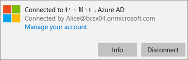
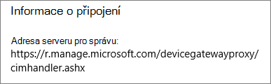
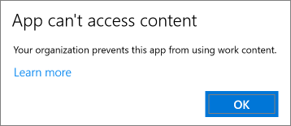
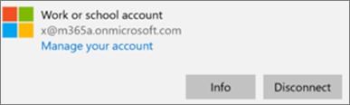
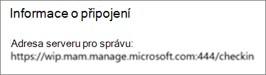

# Ověření nastavení ochrany aplikací na počítačích s Windows 10Validate app protection settings on Windows 10 PCs

## Ověření, že uživatelé nemůžou kopírovat firemní data do osobních souborů na firemních zařízeníchVerify that users cannot copy company data to personal files on corporate devices

Jakmile [nastavíte zásady ochrany aplikací](protection-settings-for-windows-10-devices.md), může to trvat několik hodin, než se tyto zásady projeví na zařízeních uživatelů.After you [set up app protection policies](protection-settings-for-windows-10-devices.md), it may take up to a few hours for the policy to take effect on users' devices. Pokud jste **zapnuli možnost** **Zabránit uživatelům v kopírování firemních dat do osobních souborů a vynutit jim uložení pracovních souborů do nastavení OneDrivu pro firmy** pro zařízení vlastněná společností, můžete to zkontrolovat na zařízení uživatele po připojení k Azure AD a přihlášení.If you turned **On** the **Prevent users from copying company data to personal files and force them to save work files to OneDrive for Business** setting for company owned devices, you can check this on the user's device after they've connected to Azure AD and signed in. 
  
 **Ověření nastavení připojení****Verify connection settings**
  
1. Až se přihlásíte pomocí přihlašovacích údajů Microsoft 365 Business a připojíte se k Azure AD, jak je popsáno v části [Nastavení zařízení s Windows pro uživatele služby Microsoft 365 Business](set-up-windows-devices.md), přejděte na **Nastavení systému Windows** \> **Účty** \> **Přístup do práce nebo do školy**. Zvolte **Připojeno k \<název tenanta\> Azure AD** a pak zvolte **Informace**.After you sign in with Microsoft 365 Business credentials and connect to Azure AD as described in [Set up Windows devices for Microsoft 365 Business users](set-up-windows-devices.md), go to **Windows Settings** \> **Accounts** \> **Access work or school**. Choose **Connected to \<tenant name\> Azure AD**, and then choose **Info**.
    
    
  
2. \> Na stránce Název **klienta** \<Správa podle můžete zobrazit **informace o připojení,** které obsahují adresu serveru pro **správu,** jako je adresa zobrazená na následujícím obrázku.On the **Managed by** \<tenant name\> page, you can see the **Connection info** that includes a **Management Server Address** like the one shown in the following figure. 
    
    
  
 **Ověření, že nelze vložit firemní data do nespravované aplikace****Verify that you cannot paste company data in a non-managed app**
  
1. Otevřete Outlook 2016 nainstalovaný přes Microsoft 365 Business.Open Outlook 2016 that was installed by Microsoft 365 Business.
    
2. Otevřete e-mail a zkopírujte z něj nějaký obsah.Open an email and copy some content from it.
    
    Otevřete Poznámkový blok a pokuste se do něho obsah vložit.Open Notepad and attempt to paste the content in.
    
    Zobrazí se chyba, která uvádí, že aplikace nemá přístup k obsahu.You'll receive an error that states the app can't access content.
    
    
  
    Stejný obsah ale můžete vložit do Wordu 2016.You can, however, paste the same content into Word 2016.
    
## Ověření, že uživatelé nemůžou kopírovat firemní data do osobních souborů na osobních zařízeníchVerify that users cannot copy company data to personal files on personal devices

 **Ověření nastavení připojení****Verify connection settings**
  
1. Na osobním zařízení s Windows 10, kde jste přihlášení jako místní uživatel, přejděte do **Nastavení Windows**a klikněte nebo klepněte na Přístup **k účtům** \> **v práci nebo ve škole**.On your Windows 10 personal device where you're logged in as a local user, go to **Windows Settings**, and click or tap **Accounts** \> **Access work or school**.
    
2. V části **Přístup do práce nebo do školy** zvolte **Připojit**.Under the **Access work or school**, choose **Connect**.
    
3. Zadejte přihlašovací údaje Microsoft 365 Business do dialogu **Nastavení pracovního nebo školního účtu** \> **Přihlásit se**.Enter your Microsoft 365 Business credential into the **Set up a work or school account dialog** \> **Sign in**.
    
4. Na stránce **Přístup do práce nebo do školy** zvolte **Pracovní nebo školní účet** a pak zvolte **Informace**.On the **Access work or school** page, choose the **Work or school account**, and then choose **Info**.
    
    
  
5. Na stránce **Práce nebo škola aplikace Access** se zobrazí informace o **připojení,** které obsahují **adresu serveru pro správu,** jako je adresa zobrazená na následujícím obrázku, a uvnitř obsahuje slova *stírací* a *mam.*On the **Access work or school** page, you can see the **Connection info** that includes a **Management Server Address** like the one shown in the following figure, and includes the words  *wip*  and  *mam*  within. 
    
    
  
 **Ověření, že nelze vložit firemní data do nespravované aplikace****Verify that you cannot paste company data in a non-managed app**
  
1. Otevřete Outlook 2016 a přidejte svůj účet Microsoft 365 Business (pokud je to potřeba) a přihlaste se přihlašovacími údaji Microsoft 365 Business.Open Outlook 2016 and add your Microsoft 365 Business account if necessary and sign in with your Microsoft 365 Business credentials.
    
2. Otevřete e-mail a zkopírujte z něj nějaký obsah.Open an email and copy some content from it.
    
    Otevřete Poznámkový blok a pokuste se do něho obsah vložit.Open Notepad and attempt to paste the content in.
    
    Zobrazí se chyba, která uvádí, že aplikace nemá přístup k obsahu.You'll receive an error that states App can't access content.
    
    
  
    Stejný obsah ale můžete vložit do Wordu 2016.You can, however, paste the same content into Word 2016.
    

