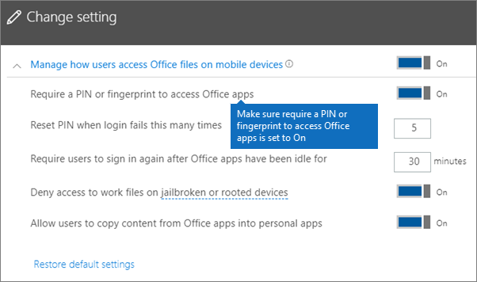
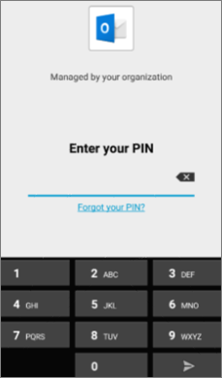
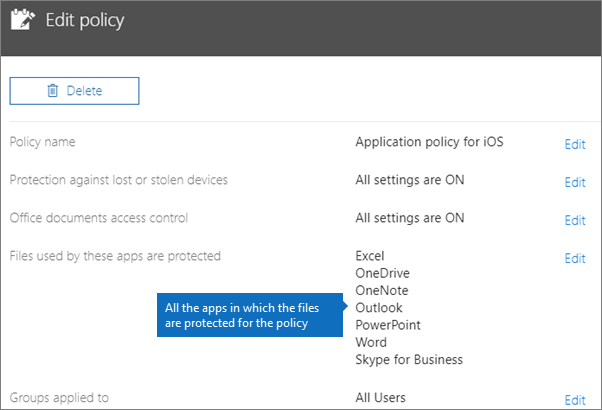
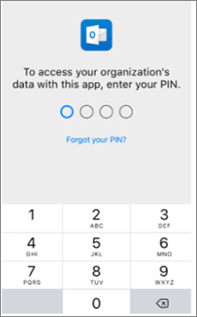

# Ověření nastavení ochrany aplikací na zařízeních s Androidem nebo iOS

Podle pokynů v následujících částech ověřte nastavení ochrany aplikací na zařízeních s Androidem nebo iOS.
  
## Android
  
### Zkontrolujte, že nastavení ochrany aplikací funguje na uživatelských zařízeních.

Jakmile [nastavíte konfigurace aplikací pro zařízení s Androidem](app-protection-settings-for-android-and-ios.md), abyste chránili aplikace, můžete tímto postupem ověřit funkčnost zvoleného nastavení. 
  
Nejdřív se ujistěte, že se zásady vztahují na aplikaci, ve které ji chcete ověřit.
  
1. V Centru Microsoft 365 Business Premium [pro správu](https://admin.microsoft.com)přejděte na **Zásady pro** \> **úpravy zásad**.
    
2. Zvolte **Zásady aplikace pro Android** pro nastavení, která jste vytvořili při nastavení, nebo jinou zásadu, kterou jste vytvořili, a ověřte, jestli je vynucovaná pro Outlook nastavení. 
    
    
  
### Ověření nastavení Vyžadovat pro přístup k aplikacím Office PIN nebo otisk prstu

V podokně **Upravit zásadu** zvolte vedle **Řízení přístupu k dokumentům Office** možnost **Upravit**, rozbalte **Spravovat přístup uživatelů k souborům Office na mobilních zařízeních** a zkontrolujte, že volba **Vyžadovat pro přístup k aplikacím Office PIN nebo otisk prstu** je nastavena na **Zapnuto**.
  

  
1. Na zařízení s Androidem uživatele otevřete Outlook a přihlaste se pomocí přihlašovacích údajů Microsoft 365 Business Premium uživatele.
    
2. Zobrazí se taky výzva k zadání PIN kódu nebo k použití otisku prstu.
    
    
  
### Ověření možnosti Resetovat PIN po několika neúspěšných pokusech

V podokně Upravit **zásadu** zvolte Upravit vedle ovládacího prvku přístupu k dokumentům Office **,** rozbalte Spravovat přístup uživatelů k souborům na mobilních zařízeních **Office** ujistěte se, že je resetování  **PIN** kódu po neúspěšných pokusech nastavené na určité číslo. Ve výchozím nastavení je to 5. 
  
1. Na zařízení s Androidem uživatele otevřete Outlook a přihlaste se pomocí přihlašovacích údajů Microsoft 365 Business Premium uživatele.
    
2. Zadejte nesprávný PIN tolikrát, kolikrát to dovoluje nastavená zásada. Zobrazí se výzva, která uvádí, že bylo dosaženo limitu pokusu **o pin** kód pro resetování PIN kódu. 
    
    
  
3. Stiskněte **Resetovat PIN kód**. Zobrazí se výzva k přihlášení pomocí přihlašovacích údajů Microsoft 365 Business Premium uživatele a pak budete muset nastavit nový PIN kód.
    
### Ověření možnosti Vynucovat, aby uživatelé ukládali všechny pracovní soubory na OneDrive pro firmy

V podokně **Upravit zásadu** zvolte vedle **Ochrana v případě ztráty nebo odcizení zařízení** možnost **Upravit**, rozbalte možnost **Chránit pracovní soubory při ztrátě nebo odcizení zařízení** a zkontrolujte, že je možnost **Vynucovat, aby uživatelé ukládali všechny pracovní soubory na OneDrive pro firmy** nastavená na **Zapnuto**.
  

  
1. Na zařízení s Androidem uživatele otevřete Outlook a přihlaste se pomocí přihlašovacích údajů Microsoft 365 Business Premium uživatele a na vyžádání zadejte PIN kód.
    
2. Otevřete e-mail, který obsahuje přílohu, a vedle informací o příloze klepněte na ikonu se šipkou dolů.
    
    
  
    V dolní části **obrazovky** se zobrazí možnost Nelze uložit do zařízení. 
    
    
  
    > [!NOTE]
    > V této chvíli není v Androidu ukládání na OneDrive pro firmy povoleno, takže vidíte jen zablokované místní ukládání. 
  
### Ověření možnosti Vyžadovat, aby se uživatelé znovu přihlásili, pokud byly aplikace Office nečinné po dobu

V  podokně Upravit zásady  zvolte Upravit vedle ovládacího prvku přístupu k dokumentům Office **,** rozbalte Spravovat přístup uživatelů k souborům na mobilních zařízeních **Office** ujistěte se, že možnost Vyžadovat, aby se uživatelé znovu přihlašoval po nečinnosti aplikací **Office** byla nastavena na několik minut. Ve výchozím nastavení je to 30 minut. 
  
1. Na zařízení s Androidem uživatele otevřete Outlook a přihlaste se pomocí přihlašovacích údajů Microsoft 365 Business Premium uživatele a na vyžádání zadejte PIN kód.
    
2. Měla by se zobrazit doručená pošta Outlooku. Nechte zařízení s Androidem nečinné aspoň 30 minut (nebo o něco déle, než jste zadali v zásadě). Obrazovka zařízení pravděpodobně ztmavne.
    
3. Znovu Outlook na zařízení s Androidem.
    
4. Před tím, než budete mít přístup k Outlook, se zobrazí výzva k zadání kódu PIN.
    
### Ověření možnosti Chránit pracovní soubory šifrováním

V podokně **Upravit zásadu** zvolte vedle **Ochrana v případě ztráty nebo odcizení zařízení** možnost **Upravit**, rozbalte možnost **Chránit pracovní soubory při ztrátě nebo odcizení zařízení** a zkontrolujte, že **ochrana pracovních souborů šifrováním** je nastavená na **Zapnuto** a možnost **Vynucovat, aby uživatelé ukládali všechny pracovní soubory na OneDrive pro firmy** je nastavená na **Vypnuto**.
  
1. Na zařízení s Androidem uživatele otevřete Outlook a přihlaste se pomocí přihlašovacích údajů Microsoft 365 Business Premium uživatele a na vyžádání zadejte PIN kód.
    
2. Otevřete e-mail, který obsahuje několik příloh obrázkových souborů.
    
3. Klepnutím na ikonu šipky vedle informací o příloze soubory uložte.
    
    
  
4. Může se zobrazit výzva, abyste Outlooku na zařízení povolili přístup k fotkám, multimediálním a jiným souborům. Klepněte na **Povolit**.
    
5. Dole na obrazovce zvolte **Uložit do zařízení** a otevřete aplikaci **Galerie**. 
    
6. Šifrovaná fotka (nebo více fotek, pokud jste uložili více příloh obrázkových souborů) by měla být v seznamu. V seznamu obrázků by se měla zobrazit jako šedý čtvereček, který má uprostřed bílý vykřičník v kroužku.
    
    
  
## iOS
  
### Kontrola nastavení ochrany aplikací na zařízeních uživatelů

Jakmile [nastavíte konfigurace aplikací pro zařízení s iOSem](app-protection-settings-for-android-and-ios.md), abyste chránili aplikace, můžete tímto postupem ověřit funkčnost zvoleného nastavení. 
  
Nejdřív se ujistěte, že se zásady vztahují na aplikaci, ve které ji chcete ověřit.
  
1. V Centru Microsoft 365 Business Premium [pro správu](https://admin.microsoft.com)přejděte na **Zásady pro** \> **úpravy zásad**.
    
2. Zvolte **Zásady aplikace pro iOS** pro nastavení, která jste vytvořili při instalaci, nebo jinou zásadu, kterou jste vytvořili, a ověřte, jestli je vynucovaná pro Outlook nastavení. 
    
    
  
### Ověření možnosti Vyžadovat pro přístup k aplikacím Office PIN

V podokně **Upravit zásadu** zvolte vedle **Řízení přístupu k dokumentům Office** možnost **Upravit**, rozbalte **Spravovat přístup uživatelů k souborům Office na mobilních zařízeních** a zkontrolujte, že volba **Vyžadovat pro přístup k aplikacím Office PIN nebo otisk prstu** je nastavena na **Zapnuto**.
  

  
1. Na zařízení s iOS uživatele otevřete Outlook a přihlaste se pomocí přihlašovacích údajů Microsoft 365 Business Premium uživatele.
    
2. Zobrazí se taky výzva k zadání PIN kódu nebo k použití otisku prstu.
    
    
  
### Ověření možnosti Resetovat PIN po několika neúspěšných pokusech

V podokně Upravit **zásadu** zvolte Upravit vedle ovládacího prvku přístupu k dokumentům Office **,** rozbalte Spravovat přístup uživatelů k souborům na mobilních zařízeních **Office** ujistěte se, že je resetování  **PIN** kódu po neúspěšných pokusech nastavené na určité číslo. Ve výchozím nastavení je to 5. 
  
1. Na zařízení s iOS uživatele otevřete Outlook a přihlaste se pomocí přihlašovacích údajů Microsoft 365 Business Premium uživatele.
    
2. Zadejte nesprávný PIN tolikrát, kolikrát to dovoluje nastavená zásada. Zobrazí se výzva, která uvádí, že bylo dosaženo limitu pokusu **o pin** kód pro resetování PIN kódu. 
    
    
  
3. Stiskněte **OK**. Zobrazí se výzva k přihlášení pomocí přihlašovacích údajů Microsoft 365 Business Premium uživatele a pak budete muset nastavit nový PIN kód.
    
### Ověření možnosti Vynucovat, aby uživatelé ukládali všechny pracovní soubory na OneDrive pro firmy

V podokně **Upravit zásadu** zvolte vedle **Ochrana v případě ztráty nebo odcizení zařízení** možnost **Upravit**, rozbalte možnost **Chránit pracovní soubory při ztrátě nebo odcizení zařízení** a zkontrolujte, že je možnost **Vynucovat, aby uživatelé ukládali všechny pracovní soubory na OneDrive pro firmy** nastavená na **Zapnuto**.
  

  
1. Na zařízení s iOSem uživatele otevřete Outlook a přihlaste se pomocí přihlašovacích údajů Microsoft 365 Business Premium uživatele a v případě vyžádání zadejte PIN kód.
    
2. Otevřete e-mail, který obsahuje přílohu. Přílohu otevřete a ve spodní části obrazovky zvolte **Uložit**. 
    
    
  
3. Měla by se zobrazit jen možnost OneDrive pro firmy. Pokud ne, **klepněte na Přidat účet** a **OneDrive pro firmy** na obrazovce Přidat **Storage účet.** Po zobrazení výzvy zadejte, Microsoft 365 Business Premium se má koncový uživatel přihlásit. 
    
    Klepněte na **Uložit** a vyberte **OneDrive pro firmy**.
    
### Ověření možnosti Vyžadovat, aby se uživatelé znovu přihlásili, pokud byly aplikace Office nečinné po dobu

V  podokně Upravit zásady  zvolte Upravit vedle ovládacího prvku přístupu k dokumentům Office **,** rozbalte Spravovat přístup uživatelů k souborům na mobilních zařízeních **Office** ujistěte se, že možnost Vyžadovat, aby se uživatelé znovu přihlašoval po nečinnosti aplikací **Office** byla nastavena na několik minut. Ve výchozím nastavení je to 30 minut. 
  
1. Na zařízení s iOSem uživatele otevřete Outlook a přihlaste se pomocí přihlašovacích údajů Microsoft 365 Business Premium uživatele a v případě vyžádání zadejte PIN kód.
    
2. Měla by se zobrazit doručená pošta Outlooku. Nechte zařízení s iOSem nečinné alespoň 30 minut (nebo o něco déle, než jste zadali v zásadě). Obrazovka zařízení pravděpodobně ztmavne.
    
3. Znovu Outlook na zařízení s iOSem.
    
4. Před tím, než budete mít přístup k Outlook, se zobrazí výzva k zadání kódu PIN.
    
### Ověření možnosti Chránit pracovní soubory šifrováním

V podokně **Upravit zásadu** zvolte vedle **Ochrana v případě ztráty nebo odcizení zařízení** možnost **Upravit**, rozbalte možnost **Chránit pracovní soubory při ztrátě nebo odcizení zařízení** a zkontrolujte, že **ochrana pracovních souborů šifrováním** je nastavená na **Zapnuto** a možnost **Vynucovat, aby uživatelé ukládali všechny pracovní soubory na OneDrive pro firmy** je nastavená na **Vypnuto**.
  
1. Na zařízení s iOSem uživatele otevřete Outlook a přihlaste se pomocí přihlašovacích údajů Microsoft 365 Business Premium uživatele a v případě vyžádání zadejte PIN kód.
    
2. Otevřete e-mail, který obsahuje několik příloh obrázkových souborů.
    
3. Klepněte na přílohu a potom klepněte níže na možnost **Uložit**. 
    
4. Na domovské obrazovce otevřete aplikaci **Fotky**. Šifrovaná fotka (nebo více fotek, pokud jste uložili více příloh obrázkových souborů) by měla uložená, ale zašifrovaná. 
    
---

