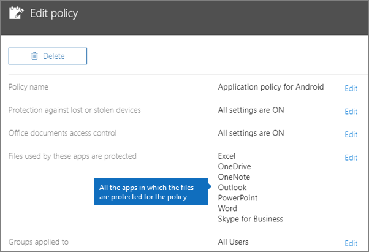
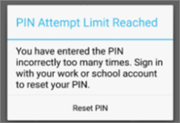
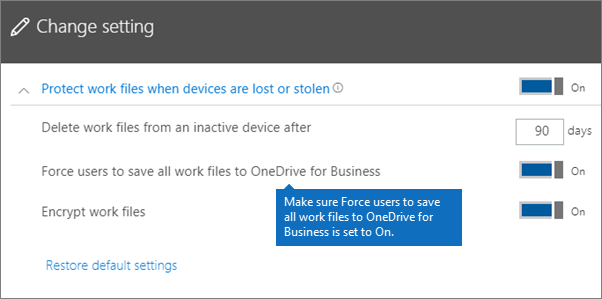
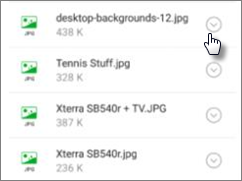
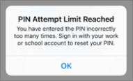

# Ověření nastavení ochrany aplikací na zařízeních se systémem Android nebo iOSValidate app protection settings on Android or iOS devices

Podle pokynů v následujících částech ověřte nastavení ochrany aplikací na zařízeních se systémem Android nebo iOS.Follow the instructions in the following sections to validate app protection settings on Android or iOS devices.
  
## AndroidAndroid
  
### Kontrola, zda nastavení ochrany aplikací funguje na uživatelských zařízeníchCheck that the app protection settings are working on user devices

Jakmile [nastavíte konfigurace aplikací pro zařízení s Androidem](app-protection-settings-for-android-and-ios.md), abyste chránili aplikace, můžete tímto postupem ověřit funkčnost zvoleného nastavení.After you [set app configurations for Android devices](app-protection-settings-for-android-and-ios.md) to protect the apps, you can follow these steps to validate that the settings you chose work. 
  
Nejprve se ujistěte, že se zásady vztahují na aplikaci, ve které ji budete ověřovat.First, make sure that the policy applies to the app in which you're going to validate it.
  
1. V [Centru pro správu](https://portal.office.com) služby Microsoft 365 Business přejděte na **Zásady** \> **Upravit zásadu**.In the Microsoft 365 Business [admin center](https://portal.office.com), go to **Policies** \> **Edit policy**.
    
2. Zvolte **Zásady aplikace pro Android** pro nastavení, které jste vytvořili v nastavení, nebo jinou zásadu, kterou jste vytvořili, a ověřte, že je vynucená například pro Outlook.Choose **Application policy for Android** for the settings you created at setup, or another policy you created, and verify that it's enforced for Outlook, for example. 
    
    
  
### Ověření nastavení Vyžadovat pro přístup k aplikacím Office PIN nebo otisk prstuValidate Require a PIN or a fingerprint to access Office apps

V podokně **Upravit zásadu** zvolte vedle **Řízení přístupu k dokumentům Office** možnost **Upravit**, rozbalte **Spravovat přístup uživatelů k souborům Office na mobilních zařízeních** a zkontrolujte, že volba **Vyžadovat pro přístup k aplikacím Office PIN nebo otisk prstu** je nastavena na **Zapnuto**.In the **Edit policy** pane, choose **Edit** next to **Office documents access control**, expand **Manage how users access Office files on mobile devices**, and make sure that **Require a PIN or fingerprint to access Office apps** is set to **On**.
  

  
1. Na zařízení uživatele s Androidem otevřete Outlook a přihlaste se pomocí uživatelského jména a hesla Microsoft 365 Business.In the user's Android device, open Outlook and sign in with the user's Microsoft 365 Business credentials.
    
2. Budete také vyzváni k zadání kódu PIN nebo použití otisku prstu.You'll also be prompted to enter a PIN or use a fingerprint.
    
    
  
### Ověření možnosti Resetovat PIN po několika neúspěšných pokusechValidate Reset PIN after number of failed attempts

V podokně **Zásady úpravy** zvolte **Upravit** vedle **ovládacího prvku přístupu k dokumentům Office**, rozbalte možnost **Spravovat způsob, jakým uživatelé přistupují k souborům Office na mobilních zařízeních**, a ujistěte se, že je **resetovat PIN kód po počtu neúspěšných pokusů** nastavený na nějaký počet.In the **Edit policy** pane, choose **Edit** next to **Office documents access control**, expand **Manage how users access Office files on mobile devices**, and make sure that **Reset PIN after number of failed attempts** is set to some number. Toje ve výchozím nastavení 5.This is 5 by default. 
  
1. Na zařízení uživatele s Androidem otevřete Outlook a přihlaste se pomocí uživatelského jména a hesla Microsoft 365 Business.In the user's Android device, open Outlook and sign in with the user's Microsoft 365 Business credentials.
    
2. Zadejte nesprávný PIN tolikrát, kolikrát to dovoluje nastavená zásada.Enter an incorrect PIN as many times as specified by the policy. Zobrazí se výzva, na které je uvedeno, že byl **dosaženo limitu pokusu o kód PIN** pro resetování kódu PIN.You'll see a prompt that states **PIN Attempt Limit Reached** to reset the PIN. 
    
    
  
3. Stiskněte **Resetovat PIN kód**.Press **Reset PIN**. Budete vyzváni k přihlášení pomocí přihlašovacích údajů uživatele microsoft 365 Business a potom budete muset nastavit nový KÓD PIN.You'll be prompted to sign in with the user's Microsoft 365 Business credentials, and then required to set a new PIN.
    
### Ověření možnosti Vynucovat, aby uživatelé ukládali všechny pracovní soubory na OneDrive pro firmyValidate Force users to save all work files to OneDrive for Business

V podokně **Upravit zásadu** zvolte vedle **Ochrana v případě ztráty nebo odcizení zařízení** možnost **Upravit**, rozbalte možnost **Chránit pracovní soubory při ztrátě nebo odcizení zařízení** a zkontrolujte, že je možnost **Vynucovat, aby uživatelé ukládali všechny pracovní soubory na OneDrive pro firmy** nastavená na **Zapnuto**.In the **Edit policy** pane, choose **Edit** next to **Protection against lost or stolen devices**, expand **Protect work files when devices are lost or stolen**, and make sure that **Force users to save all work files to OneDrive for Business** is set to **On**.
  

  
1. Na uživatelském zařízení s Androidem otevřete Outlook a přihlaste se pod uživatelským jménem a heslem Microsoft 365 Business. Pokud k tomu budete vyzváni, zadejte PIN.In the user's Android device, open Outlook and sign in with the user's Microsoft 365 Business credentials, and enter a PIN if requested.
    
2. Otevřete e-mail, který obsahuje přílohu, a vedle informací o příloze klepněte na ikonu se šipkou dolů.Open an email that contains an attachment and tap the down arrow icon next to the attachment's information.
    
    
  
    V dolní části obrazovky se zobrazí **možnost Nelze uložit do zařízení.**You'll see **Cannot save to device** on the bottom of the screen. 
    
    
  
    > [!NOTE]
    > V této chvíli není v Androidu ukládání na OneDrive pro firmy povoleno, takže vidíte jen zablokované místní ukládání.Saving to OneDrive for Business is not enabled for Android at this time, so you can only see that saving locally is blocked. 
  
### Ověření možnosti Vyžadovat, aby se uživatelé znovu přihlásili, pokud byly aplikace Office nečinné po dobuValidate Require user to sign in again if Office apps have been idle for a specified time

V podokně **Zásady úpravy** zvolte **Upravit** vedle **ovládacího prvku přístupu k dokumentům Office**, rozbalte **možnost Spravovat způsob, jakým uživatelé přistupují k souborům Office na mobilních zařízeních**, a ujistěte se, že po nečinnosti aplikací Office bylo **nastaveno** na určitý počet minut.In the **Edit policy** pane, choose **Edit** next to **Office documents access control**, expand **Manage how users access Office files on mobile devices**, and make sure that **Require users to sign in again after Office apps have been idle for** is set to some number of minutes. To je ve výchozím nastavení 30 minut.This is 30 minutes by default. 
  
1. Na uživatelském zařízení s Androidem otevřete Outlook a přihlaste se pod uživatelským jménem a heslem Microsoft 365 Business. Pokud k tomu budete vyzváni, zadejte PIN.In the user's Android device, open Outlook and sign in with the user's Microsoft 365 Business credentials, and enter a PIN if requested.
    
2. Měla by se zobrazit doručená pošta Outlooku. Nechte zařízení s Androidem nečinné aspoň 30 minut (nebo o něco déle, než jste zadali v zásadě). Obrazovka zařízení pravděpodobně ztmavne.You should now see Outlook's inbox. Let the Android device idle untouched for at least 30 minutes (or some other amount of time, longer than what you specified in the policy). The device will likely dim.
    
3. Znovu získejte přístup k Outlooku na zařízení s Androidem.Access Outlook on the Android device again.
    
4. Než budete mít přístup k Outlooku, budete vyzváni k zadání kódu PIN.You'll be prompted to enter your PIN before you can access Outlook again.
    
### Ověření možnosti Chránit pracovní soubory šifrovánímValidate Protect work files with encryption

V podokně **Upravit zásadu** zvolte vedle **Ochrana v případě ztráty nebo odcizení zařízení** možnost **Upravit**, rozbalte možnost **Chránit pracovní soubory při ztrátě nebo odcizení zařízení** a zkontrolujte, že **ochrana pracovních souborů šifrováním** je nastavená na **Zapnuto** a možnost **Vynucovat, aby uživatelé ukládali všechny pracovní soubory na OneDrive pro firmy** je nastavená na **Vypnuto**.In the **Edit policy** pane, choose **Edit** next to **Protection against lost or stolen devices**, expand **Protect work files when devices are lost or stolen**, and make sure that **Protect work files with encryption** is set to **On**, and **Force users to save all work files to OneDrive for Business** is set to **Off**.
  
1. Na uživatelském zařízení s Androidem otevřete Outlook a přihlaste se pod uživatelským jménem a heslem Microsoft 365 Business. Pokud k tomu budete vyzváni, zadejte PIN.In the user's Android device, open Outlook and sign in with the user's Microsoft 365 Business credentials, and enter a PIN if requested.
    
2. Otevřete e-mail, který obsahuje několik příloh souboru obrázků.Open an email that contains a few image file attachments.
    
3. Klepnutím na ikonu šipky vedle informací o příloze soubory uložte.Tap the down arrow icon next to the attachment's info to save it.
    
    
  
4. Může se zobrazit výzva, abyste Outlooku na zařízení povolili přístup k fotkám, multimediálním a jiným souborům. Klepněte na **Povolit**.You may be prompted to allow Outlook to access photos, media, and files on your device. Tap **Allow**.
    
5. Dole na obrazovce zvolte **Uložit do zařízení** a otevřete aplikaci **Galerie**.At the bottom of the screen, choose to **Save to Device** and then open the **Gallery** app. 
    
6. Šifrovaná fotka (nebo více fotek, pokud jste uložili více příloh obrázkových souborů) by měla být v seznamu. V seznamu obrázků by se měla zobrazit jako šedý čtvereček, který má uprostřed bílý vykřičník v kroužku.You should see an encrypted photo (or more, if you saved multiple image file attachments) in the list. It may appear in the Pictures list as a gray square with a white exclamation point within a white circle in the center of the gray square.
    
    
  
## IosiOS
  
### Kontrola nastavení ochrany aplikací na zařízeních uživatelůCheck that the App protection settings are working on user devices

Jakmile [nastavíte konfigurace aplikací pro zařízení s iOSem](app-protection-settings-for-android-and-ios.md), abyste chránili aplikace, můžete tímto postupem ověřit funkčnost zvoleného nastavení.After you [set app configurations for iOS devices](app-protection-settings-for-android-and-ios.md) to protect apps, you can follow these steps to validate that the settings you chose work. 
  
Nejprve se ujistěte, že se zásady vztahují na aplikaci, ve které ji budete ověřovat.First, make sure that the policy applies to the app in which you're going to validate it.
  
1. V [Centru pro správu](https://portal.office.com) služby Microsoft 365 Business přejděte na **Zásady** \> **Upravit zásadu**.In the Microsoft 365 Business [admin center](https://portal.office.com), go to **Policies** \> **Edit policy**.
    
2. Zvolte **Zásady aplikace pro iOS** pro nastavení, které jste vytvořili v nastavení, nebo pro jinou zásadu, kterou jste vytvořili, a ověřte, že je vynucená například pro Outlook.Choose **Application policy for iOS** for the settings you created at setup, or another policy you created, and verify that it's enforced for Outlook for example. 
    
    
  
### Ověření možnosti Vyžadovat pro přístup k aplikacím Office PINValidate Require a PIN to access Office apps

V podokně **Upravit zásadu** zvolte vedle **Řízení přístupu k dokumentům Office** možnost **Upravit**, rozbalte **Spravovat přístup uživatelů k souborům Office na mobilních zařízeních** a zkontrolujte, že volba **Vyžadovat pro přístup k aplikacím Office PIN nebo otisk prstu** je nastavena na **Zapnuto**.In the **Edit policy** pane, choose **Edit** next to **Office documents access control**, expand **Manage how users access Office files on mobile devices**, and make sure that **Require a PIN or fingerprint to access Office apps** is set to **On**.
  

  
1. Na zařízení uživatele s iOSem otevřete Outlook a přihlaste se pomocí uživatelského jména a hesla Microsoft 365 Business.In the user's iOS device, open Outlook and sign in with the user's Microsoft 365 Business credentials.
    
2. Budete také vyzváni k zadání kódu PIN nebo použití otisku prstu.You'll also be prompted to enter a PIN or use a fingerprint.
    
    
  
### Ověření možnosti Resetovat PIN po několika neúspěšných pokusechValidate Reset PIN after number of failed attempts

V podokně **Zásady úpravy** zvolte **Upravit** vedle **ovládacího prvku přístupu k dokumentům Office**, rozbalte možnost **Spravovat způsob, jakým uživatelé přistupují k souborům Office na mobilních zařízeních**, a ujistěte se, že je **resetovat PIN kód po počtu neúspěšných pokusů** nastavený na nějaký počet.In the **Edit policy** pane, choose **Edit** next to **Office documents access control**, expand **Manage how users access Office files on mobile devices**, and make sure that **Reset PIN after number of failed attempts** is set to some number. Toje ve výchozím nastavení 5.This is 5 by default. 
  
1. Na zařízení uživatele s iOSem otevřete Outlook a přihlaste se pomocí uživatelského jména a hesla Microsoft 365 Business.In the user's iOS device, open Outlook and sign in with the user's Microsoft 365 Business credentials.
    
2. Zadejte nesprávný PIN tolikrát, kolikrát to dovoluje nastavená zásada.Enter an incorrect PIN as many times as specified by the policy. Zobrazí se výzva, na které je uvedeno, že byl **dosaženo limitu pokusu o kód PIN** pro resetování kódu PIN.You'll see a prompt that states **PIN Attempt Limit Reached** to reset the PIN. 
    
    
  
3. Stiskněte **OK**.Press **OK**. Budete vyzváni k přihlášení pomocí přihlašovacích údajů uživatele microsoft 365 Business a potom budete muset nastavit nový KÓD PIN.You'll be prompted to sign in with the user's Microsoft 365 Business credentials, and then required to set a new PIN.
    
### Ověření možnosti Vynucovat, aby uživatelé ukládali všechny pracovní soubory na OneDrive pro firmyValidate Force users to save all work files to OneDrive for Business

V podokně **Upravit zásadu** zvolte vedle **Ochrana v případě ztráty nebo odcizení zařízení** možnost **Upravit**, rozbalte možnost **Chránit pracovní soubory při ztrátě nebo odcizení zařízení** a zkontrolujte, že je možnost **Vynucovat, aby uživatelé ukládali všechny pracovní soubory na OneDrive pro firmy** nastavená na **Zapnuto**.In the **Edit policy** pane, choose **Edit** next to **Protection against lost or stolen devices**, expand **Protect work files when devices are lost or stolen**, and make sure that **Force users to save all work files to OneDrive for Business** is set to **On**.
  

  
1. Na uživatelském zařízení s iOSem otevřete Outlook a přihlaste se pod uživatelským jménem a heslem Microsoft 365 Business. Pokud k tomu budete vyzváni, zadejte PIN.In the user's iOS device, open Outlook and sign in with the user's Microsoft 365 Business credentials, and enter a PIN if requested.
    
2. Otevřete e-mail, který obsahuje přílohu. Přílohu otevřete a ve spodní části obrazovky zvolte **Uložit**.Open an email that contains an attachment, open the attachment and choose **Save** on the bottom of the screen. 
    
    
  
3. Měla by se zobrazit jen možnost OneDrive pro firmy.You should only see an option for OneDrive for Business. Pokud ne, klepněte na **Přidat účet** a na obrazovce Přidat **účet úložiště** vyberte **OneDrive pro firmy.**If not, tap **Add Account** and select **OneDrive for Business** from the **Add Storage Account** screen. Po zobrazení výzvy zadejte přihlašovací údaje koncového uživatele pro Microsoft 365 Business.Provide the end user's Microsoft 365 Business to sign in when prompted. 
    
    Klepněte na **Uložit** a vyberte **OneDrive pro firmy**.Tap **Save** and select **OneDrive for Business**.
    
### Ověření možnosti Vyžadovat, aby se uživatelé znovu přihlásili, pokud byly aplikace Office nečinné po dobuValidate Require user to sign in again if Office apps have been idle for a specified time

V podokně **Zásady úpravy** zvolte **Upravit** vedle **ovládacího prvku přístupu k dokumentům Office**, rozbalte **možnost Spravovat způsob, jakým uživatelé přistupují k souborům Office na mobilních zařízeních**, a ujistěte se, že po nečinnosti aplikací Office bylo **nastaveno** na určitý počet minut.In the **Edit policy** pane, choose **Edit** next to **Office documents access control**, expand **Manage how users access Office files on mobile devices**, and make sure that **Require users to sign in again after Office apps have been idle for** is set to some number of minutes. To je ve výchozím nastavení 30 minut.This is 30 minutes by default. 
  
1. Na uživatelském zařízení s iOSem otevřete Outlook a přihlaste se pod uživatelským jménem a heslem Microsoft 365 Business. Pokud k tomu budete vyzváni, zadejte PIN.In the user's iOS device, open Outlook and sign in with the user's Microsoft 365 Business credentials, and enter a PIN if requested.
    
2. Měla by se zobrazit doručená pošta Outlooku. Nechte zařízení s iOSem nečinné alespoň 30 minut (nebo o něco déle, než jste zadali v zásadě). Obrazovka zařízení pravděpodobně ztmavne.You should now see Outlook's inbox. Let the iOS device untouched for at least 30 minutes (or some other amount of time, longer than what you specified in the policy). The device will likely dim.
    
3. Znovu získejte přístup k Outlooku na iOS zařízení.Access Outlook on the iOS device again.
    
4. Než budete mít přístup k Outlooku, budete vyzváni k zadání kódu PIN.You'll be prompted to enter your PIN before you can access Outlook again.
    
### Ověření možnosti Chránit pracovní soubory šifrovánímValidate Protect work files with encryption

V podokně **Upravit zásadu** zvolte vedle **Ochrana v případě ztráty nebo odcizení zařízení** možnost **Upravit**, rozbalte možnost **Chránit pracovní soubory při ztrátě nebo odcizení zařízení** a zkontrolujte, že **ochrana pracovních souborů šifrováním** je nastavená na **Zapnuto** a možnost **Vynucovat, aby uživatelé ukládali všechny pracovní soubory na OneDrive pro firmy** je nastavená na **Vypnuto**.In the **Edit policy** pane, choose **Edit** next to **Protection against lost or stolen devices**, expand **Protect work files when devices are lost or stolen**, and make sure that **Protect work files with encryption** is set to **On**, and **Force users to save all work files to OneDrive for Business** is set to **Off**.
  
1. Na uživatelském zařízení s iOSem otevřete Outlook a přihlaste se pod uživatelským jménem a heslem Microsoft 365 Business. Pokud k tomu budete vyzváni, zadejte PIN.In the user's iOS device, open Outlook and sign in with the user's Microsoft 365 Business credentials, and enter a PIN if requested.
    
2. Otevřete e-mail, který obsahuje několik příloh souboru obrázků.Open an email that contains a few image file attachments.
    
3. Klepněte na přílohu a potom klepněte níže na možnost **Uložit**.Tap the attachment and then tap the **Save** option under it. 
    
4. Na domovské obrazovce otevřete aplikaci **Fotky**. Šifrovaná fotka (nebo více fotek, pokud jste uložili více příloh obrázkových souborů) by měla uložená, ale zašifrovaná.Open **Photos** app from the home screen. You should see an encrypted photo (or more, if you saved multiple image file attachments) saved, but encrypted. 
    
---

