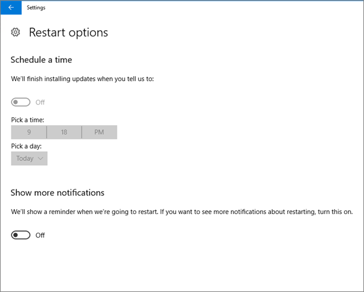
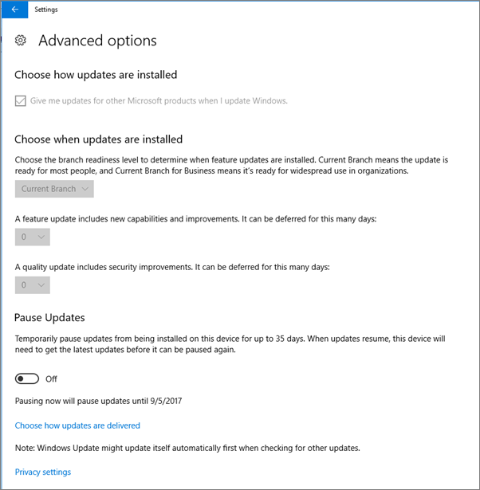
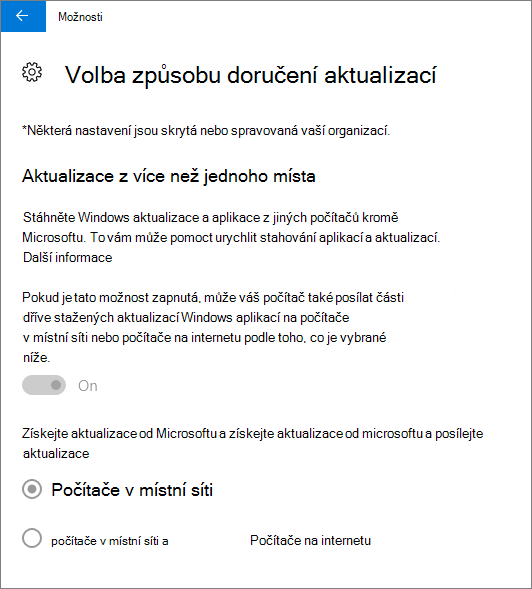
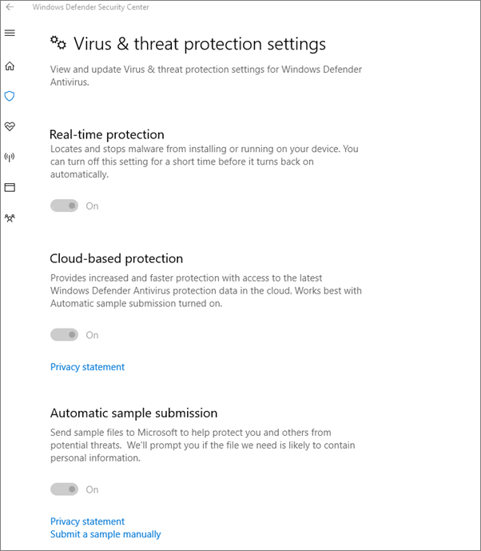

# Ověření nastavení ochrany zařízení na počítačích s Windows 10

## Ověření nastavení zásad zařízení s Windows 10

Po nastavení [zásad zařízení](protection-settings-for-windows-10-pcs.md)může trvat až několik hodin, než se zásada projeví na zařízeních uživatelů. Můžete potvrdit, že se zásady projeví, když se podíváme na různé obrazovky nastavení Windows na zařízeních uživatelů. Vzhledem k tomu, že uživatelé nebudou moct na svých zařízeních s Windows 10 upravovat nastavení Antivirové ochrany v programu Windows Update a Windows Defender, mnoho možností se zobrazí šedě.
  
1. Přejděte na **Nastavení** \> **Aktualizace &amp; zabezpečení** \> **Windows Update** \> **Možnosti restartování** a potvrďte, že jsou všechna nastavení šedá. 
    
    
  
2. Přejděte na **Nastavení Aktualizace** zabezpečení Windows Update – upřesnit možnosti a ověřte, že všechna nastavení \> **&amp;** jsou \>  \>  šedá. 
    
    
  
3. Přejděte na **Nastavení** \> **Aktualizace &amp; zabezpečení** \> **Windows Update** \> **– upřesnit možnosti** \> **Zvolte způsob doručení aktualizací.**
    
    Potvrďte, že vidíte zprávu (červeně), že některá nastavení jsou skrytá nebo spravovaná vaší organizací a všechny možnosti jsou šedé.
    
    
  
4. Pokud chcete otevřít Centrum zabezpečení  v programu Windows Defender, přejděte na Nastavení Aktualizace zabezpečení Windows Defenderu klikněte na Otevřít Centrum zabezpečení v programu Windows Defender Ochrana proti virům ochrana před vlákny \> **&amp;** Nastavení \>  \> ochrany  \> **&amp;** \> **&amp; před viry**. 
    
5. Ověřte, jestli jsou všechny možnosti šedé. 
    
    
  
## Související témata

[Dokumentace a materiály k Microsoftu 365 pro firmy](./index.yml)
  
[Začínáme s Microsoft 365 pro firmy](microsoft-365-business-overview.md)
  
[Správa Microsoftu 365 pro firmy](manage.md)
  
[Nastavení konfigurací zařízení pro počítače s Windows 10](protection-settings-for-windows-10-pcs.md)
