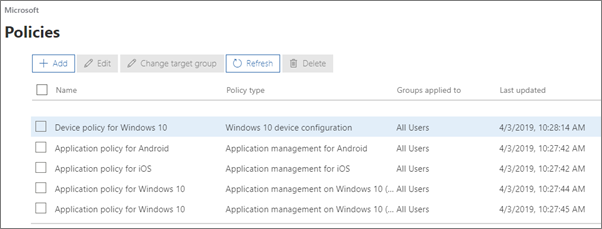
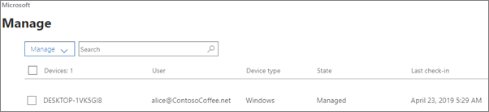

# Zobrazení a správa zásad a zařízení

## Zobrazení a úprava zásad zařízení

1.  Přejděte do Centra pro správu na adrese <a href="https://go.microsoft.com/fwlink/p/?linkid=837890" target="_blank">https://admin.microsoft.com</a> .
2. Na levém virtuálním **Devices** zařízení zvolte \> **Zásady**zařízení .

    Na této stránce můžete vytvořit, upravit, změnit cílovou skupinu nebo odstranit zásadu.

    
  
## Zobrazení a správa zařízení

1. Na levém virtuálním zařízení zvolte **Správa zařízení** \> **Manage**. 
    
    Na této stránce můžete vybrat jedno nebo více zařízení a odebrat firemní data. U zařízení s Windows 10, kterým jste nastavili ochranu, můžete také vybrat, že chcete obnovit jejich tovární nastavení.
  
   

